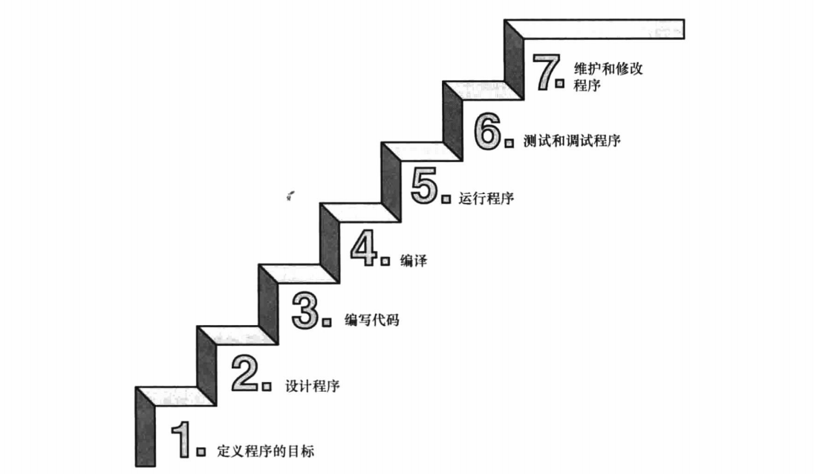
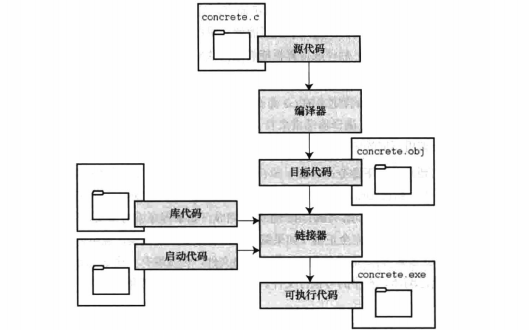
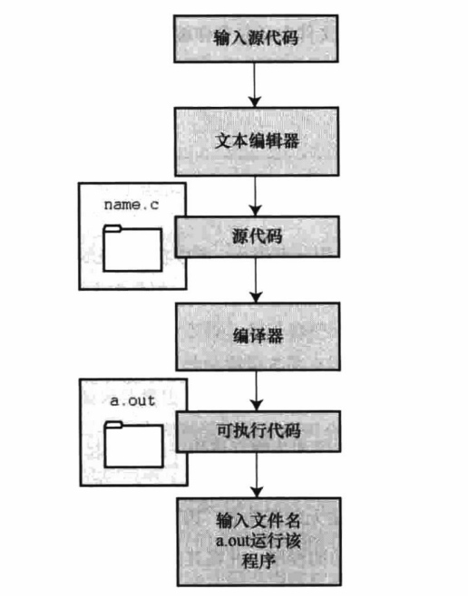

# 初识 C 语言

## 计算机能做什么

在学习如何用 C 语言编程之前，最好先了解一下计算机的工作原理。这些知识有助于你理解用 C 语言编写程序和运行 C 程序时所发生的事情之间有什么联系。

现代的计算机由多种部件构成。

- 中央处理单元( CPU )承担绝大部分的运算工作。
- 随机存取内存( RAM )是存储程序和文件的工作区；
- 而永久内存存储设备( 过去一般指机械硬盘，现在还包括固态硬盘 )即使在关闭计算机后，也不会丢失之前储存的程序和文件。
- 另外，还有各种外围设备( 如，键盘、鼠标、触摸屏、监视器 )提供人与计算机之间的交互。
- CPU 负责处理程序，接下来我们重点讨论它的工作原理。

CPU 的工作非常简单，至少从以下简短的描述中看是这样。
>它从内存中获取并执行一条指令，然后再从内存中获取并执行下一条指令，诸如此类( 一个吉赫兹的 CPU 一秒钟能重复这样的操作大约十亿次，因此，CPU 能以惊人的速度从事枯燥的工作 )。

CPU 有自己的小工作区——由若干个寄存器组成，每个寄存器都可以储存一个数字。一个寄存器储存下一条指令的内存地址， CPU 使用该地址来获取和更新下一条指令。

在获取指令后，CPU 在另一个寄存器中储存该指令，并更新第1个寄存器储存下一条指令的地址。CPU 能理解的指令有限( 这些指令的集合叫作指令集 )。而且，这些指令相当具体，其中的许多指令都是用于请求计算机把一个数字从一个位置移动到另一个位置。例如，从内存移动到寄存器。

下面介绍两个有趣的知识。

其一，储存在计算机中的所有内容都是数字。计算机以数字形式储存数字和字符( 如，在文本文档中使用的字母 )。每个字符都有一个数字码。计算机载入寄存器的指令也以数字形式储存，指令集中的每条指令都有一个数字码。

其二，计算机程序最终必须以数字指令码( 即，机器语言 )来表示。

简而言之，计算机的工作原理是：如果希望计算机做某些事，就必须为其提供特殊的指令列表( 程序 ),确切地告诉计算机要做的事以及如何做。你必须用计算机能直接明白的语言( 机器语言 )创建程序。这是一项繁琐、乏味、费力的任务。计算机要完成诸如两数相加这样简单的事，就得分成类似以下几个步骤。

1. 从内存位置2000上把一个数字拷贝到寄存器1。
2. 从内存位置2004上把另一个数字拷贝到寄存器2。
3. 把寄存器2中的内容与寄存器1中的内容相加，把结果储存在寄存器1中。
4. 把寄存器1中的内容拷贝到内存位置2008。

而你要做的是，必须用数字码来表示以上的每个步骤!

如果以这种方式编写程序很合你的意，那不得不说抱歉，因为用机器语言编程的黄金时代已一去不复返。但是，如果你对有趣的事情比较感兴趣，不妨试试高级编程语言。

## 语言标准

目前，有许多C实现可用。在理想情况下，编写 C 程序时，假设该程序中未使用机器特定的编程技术，那么它的运行情况在任何实现中都应该相同。要在实践中做到这一点，不同的实现要遵循同一个标准。

C 语言发展之初，并没有所谓的C标准。1987年，布莱恩·柯林汉( Brian Kernighan )和丹尼斯·里奇( Dennis Ritchie )合著的 The C Programming Language (《C 语言程序设计》)第1版是公认的 C 标准，通常称之为 K&RC 或经典 C。特别是，该书中的附录中的“ C 语言参考手册”已成为实现 C 的指导标准。例如，编译器都声称提供完整的 K&R 实现。虽然这本书中的附录定义了 C 语言，但却没有定义 C 库。与大多数语言不同的是，C 语言比其他语言更依赖库，因此需要一个标准库。实际上，由于缺乏官方标准，UNIX 实现提供的库已成为了标准库。

## 第1个 ANSI/ISOC 标准

随着 C 的不断发展，越来越广泛地应用于更多系统中，C 社区意识到需要一个更全面、更新颖、更严格的标准。鉴于此，美国国家标准协会( ANSI )于1983年组建了一个委员会( X3J11 ),开发了一套新标准，并于1989年正式公布。该标准( ANSIC )定义了 C 语言和 C 标准库。国际标准化组织于1990年采用了这套 C 标准( ISO C )。ISOC 和 ANSIC 是完全相同的标准。ANSI/ISO 标准的最终版本通常叫作 C89 ( 因为ANSI于1989年批准该标准 )或 C90 ( 因为 ISO 于1990年批准该标准)。另外，由于 ANSI 先公布 C 标准，因此业界人士通常使用 ANSI C。
在该委员会制定的指导原则中，最有趣的可能是：保持 C 的精神。委员会在表述这一精神时列出了以
下几点：

- 信任程序员；
- 不要妨碍程序员做需要做的事；
- 保持语言精练简单；
- 只提供一种方法执行一项操作；让程序运行更快，即使不能保证其可移植性。

在最后一点上，标准委员会的用意是：作为实现，应该针对目标计算机来定义最合适的某特定操作，而不是强加一个抽象、统一的定义。在学习 C 语言过程中，许多方面都反映了这一哲学思想。

## C99 标准

1994年，ANSI/ISO 联合委员会( C9X委员会 )开始修订 C 标准，最终发布了 C99 标准。该委员会遵循了最初 C90 标准的原则，包括保持语言的精练简单。委员会的用意不是在 C 语言中添加新特性，而是为了达到新的目标。

第1个目标是，支持国际化编程。例如，提供多种方法处理国际字符集。

第2个目标是，“调整现有实践致力于解决明显的缺陷”。因此，在遇到需要将 C 移至64位处理器时，委员会根据现实生活中处理问题的经验来添加标准。

第3个目标是，为适应科学和工程项目中的关键数值计算，提高 C 的适应性，让 C 比 FORTRAN 更有竞争力。

这3点( 国际化、弥补缺陷和提高计算的实用性 )是主要的修订目标。

在其他方面的改变则更为保守，例如，尽量与 C90、C++ 兼容，让语言在概念上保持简单。用委员会的话说：“……委员会很满意让 C++ 成为大型、功能强大的语言”。

C99 的修订保留了 C 语言的精髓， C 仍是一门简洁高效的语言。本书指出了许多 C99 修改的地方。虽然该标准已发布了很长时间，但并非所有的编译器都完全实现 C99 的所有改动。因此，你可能发现 C99 的一些改动在自己的系统中不可用，或者只有改变编译器的设置才可用。

## C11 标准

维护标准任重道远。

标准委员会在2007年承诺 C 标准的下一个版本是 CIX,2011年终于发布了 Cl1 标准。此次，委员会提出了一些新的指导原则。

出于对当前编程安全的担忧，不那么强调“信任程序员”目标了。而且，供应商并未像对 C90 那样很好地接受和支持 C99。这使得 C99 的一些特性成为 C11 的可选项。因为委员会认为，不应要求服务小型机市场的供应商支持其目标环境中用不到的特性。

另外需要强调的是，修订标准的原因不是因为原标准不能用，而是需要跟进新的技术。例如，新标准添加了可选项支持当前使用多处理器的计算机。对于 Cl1 标准，我们浅尝辄止，深入分析这部分内容已超出本书讨论的范围。

## 使用 C 语言的七个步骤



### 第1步：定义程序的目标

在动手写程序之前，要在脑中有清晰的思路。想要程序去做什么首先自己要明确自己想做什么,思考你的程序需要哪些信息，要进行哪些计算和控制，以及程序应该要报告什么信息。在这一步骤中，不涉及具体的计算机语言，应该用一般术语来描述问题。

### 第2步：设计程序

对程序应该完成什么任务有概念性的认识后，就应该考虑如何用程序来完成它。例如，用户界面应该是怎样的?如何组织程序?目标用户是谁?准备花多长时间来完成这个程序?
除此之外，还要决定在程序(还可能是辅助文件)中如何表示数据，以及用什么方法处理数据。学习C语言之初，遇到的问题都很简单，没什么可选的。但是，随着要处理的情况越来越复杂，需要决策和考虑的方面也越来越多。通常，选择一个合适的方式表示信息可以更容易地设计程序和处理数据。
再次强调，应该用一般术语来描述问题，而不是用具体的代码。但是，你的某些决策可能取决于语言的特性。例如，在数据表示方面，C的程序员就比Pascal的程序员有更多选择。

### 第3步：编写代码

设计好程序后，就可以编写代码来实现它。也就是说，把你设计的程序翻译成C语言。这里是真正需要使用C语言的地方。可以把思路写在纸上，但是最终还是要把代码输入计算机。这个过程的机制取决于编程环境，我们稍后会详细介绍一些常见的环境。一般而言，使用文本编辑器创建源代码文件。该文件中内容就是你翻译的C语言代码。程序清单1.1是一个C源代码的示例。
程序清单1.1 C源代码示例

```c
#include <stdio.h>
int main(void)
{
int dogs;
printf("How many dogs do you have?\n");
scanf("8d",&dogs);
printf("So you have 8d dog(s)!\n",dogs);
}
return 0;
```

在这一步骤中，应该给自己编写的程序添加文字注释。最简单的方式是使用C的注释工具在源代码中加入对代码的解释。第2章将详细介绍如何在代码中添加注释。

### 第4步：编译

接下来的这一步是编译源代码。再次提醒读者注意，编译的细节取决于编程的环境，我们稍后马上介绍一些常见的编程环境。现在，先从概念的角度讲解编译发生了什么事情。
前面介绍过，编译器是把源代码转换成可执行代码的程序。可执行代码是用计算机的机器语言表示的代码。这种语言由数字码表示的指令组成。如前所述，不同的计算机使用不同的机器语言方案。C 编译器负责把 C 代码翻译成特定的机器语言。此外，C 编译器还将源代码与 C 库(库中包含大量的标准函数供用户使用，如 printf() 和 scanf() )的代码合并成最终的程序( 更精确地说，应该是由一个被称为链接器的程序来链接库函数，但是在大多数系统中，编译器运行链接器 )。其结果是，生成一个用户可以运行的可执行文件，其中包含着计算机能理解的代码。
编译器还会检查 C 语言程序是否有效。如果 C 编译器发现错误，就不生成可执行文件并报错。理解特定编译器报告的错误或警告信息是程序员要掌握的另一项技能。

### 第5步：运行程序

传统上，可执行文件是可运行的程序。在常见环境( 包括Windows 命令提示符模式、UNIX 终端模式和 Linux 终端模式 )中运行程序要输入可执行文件的文件名，而其他环境可能要运行命令( 如，在 VAX 中的 VMS )或一些其他机制。例如，在 Windows 和 Macintosh 提供的集成开发环境( IDE )中，用户可以在 IDE 中通过选择菜单中的选项或按下特殊键来编辑和执行 C 程序。最终生成的程序可通过单击或双击文件名或图标直接在操作系统中运行。

### 第6步：测试和调试程序

程序能运行是个好迹象，但有时也可能会出现运行错误。接下来，应该检查程序是否按照你所设计的思路运行。你会发现你的程序中有一些错误，计算机行话叫作 bug。查找并修复程序错误的过程叫调试。学习的过程中不可避免会犯错，学习编程也是如此。因此，当你把所学的知识应用于编程时，最好为自己会犯错做好心理准备。随着你越来越老练，你所写的程序中的错误也会越来越不易察觉。
将来犯错的机会很多。你可能会犯基本的设计错误，可能错误地实现了一个好想法，可能忽视了输入检查导致程序瘫痪，可能会把圆括号放错地方，可能误用C语言或打错字，等等。把你将来犯错的地方列出来，这份错误列表应该会很长。
看到这里你可能会有些绝望，但是情况没那么糟。现在的编译器会捕获许多错误，而且自己也可以找到编译器未发现的错误。在学习本书的过程中，我们会给读者提供一些调试的建议。

### 第7步：维护和修改代码

创建完程序后，你发现程序有错，或者想扩展程序的用途，这时就要修改程序。例如，用户输入以Zz开头的姓名时程序出现错误、你想到了一个更好的解决方案、想添加一个更好的新特性，或者要修改程序使其能在不同的计算机系统中运行，等等。如果在编写程序时清楚地做了注释并采用了合理的设计方案，这些事情都很简单。

### 说明

编程并非像描述那样是一个线性的过程。有时，要在不同的步骤之间往复。例如，在写代码时发现之前的设计不切实际，或者想到了一个更好的解决方案，或者等程序运行后，想改变原来的设计思路。对程序做文字注释为今后的修改提供了方便。
许多初学者经常忽略第1步和第2步( 定义程序目标和设计程序 ),直接跳到第3步( 编写代码 )。刚开始学习时，编写的程序非常简单，完全可以在脑中构思好整个过程。即使写错了，也很容易发现。但是，随着编写的程序越来越庞大、越来越复杂，动脑不动手可不行，而且程序中隐藏的错误也越来越难找。最终，那些跳过前两个步骤的人往往浪费了更多的时间，因为他们写出的程序难看、缺乏条理、让人难以理解。要编写的程序越大越复杂，事先定义和设计程序环节的工作量就越大。

## 编程机制

用C语言编写程序时，编写的内容被储存在文本文件中，该文件被称为源代码文件( source code file )。大部分 C 系统，包括之前提到的，都要求文件名以 .c 结尾( 如，wordcount.c 和 budget.c )。在文件名中，点号(.)前面的部分称为基本名( basename ),点号后面的部分称为扩展名( extension )。因此，budget是基本名，c 是扩展名。基本名与扩展名的组合( budget.c )就是文件名。文件名应该满足特定计算机操作系统的特殊要求。例如，MS-DOS 是 IBM PC 及其兼容机的操作系统，比较老旧，它要求基本名不能超过8个字符。因此，刚才提到的文件名 wordcount.c 就是无效的 DOS 文件名。有些 UNIX 系统限制整个文件名( 包括扩展名 )不超过14个字符，而有些UNIX系统则允许使用更长的文件名，最多255个字符。Linux、Windows 和 Macintosh OS 都允许使用长文件名。

接下来，我们来看一下具体的应用，假设有一个名为concrete.c的源文件，其中的C源代码如程序
清单1.2所示。

程序清单1.2 c程序

```c
#include <stdio.h>
int main(void)(
printf("Concrete contains gravel and cement.\n");
}
return 0;
```

### 目标代码文件、可执行文件和库

C 编程的基本策略是，用程序把源代码文件转换为可执行文件( 其中包含可直接运行的机器语言代码 )。典型的 C 实现通过编译和链接两个步骤来完成这一过程。编译器把源代码转换成中间代码，链接器把中间代码和其他代码合并，生成可执行文件。C 使用这种分而治之的方法方便对程序进行模块化，可以独立编译单独的模块，稍后再用链接器合并已编译的模块。通过这种方式，如果只更改某个模块，不必因此重新编译其他模块。另外，链接器还将你编写的程序和预编译的库代码合并。

中间文件有多种形式。我们在这里描述的是最普遍的一种形式，即把源代码转换为机器语言代码，并把结果放在目标代码文件( 或简称目标文件 )中( 这里假设源代码只有一个文件 )。虽然目标文件中包含机器语言代码，但是并不能直接运行该文件。因为目标文件中储存的是编译器翻译的源代码，这还不是一个完整的程序。

目标代码文件缺失启动代码( startup code )。启动代码充当着程序和操作系统之间的接口。例如，可以在 MS Windows 或 Linux 系统下运行 IBMPC 兼容机。这两种情况所使用的硬件相同，所以目标代码相同，但是Windows和Linux所需的启动代码不同，因为这些系统处理程序的方式不同。
目标代码还缺少库函数。几乎所有的C程序都要使用C标准库中的函数。

例如，concrete.c 中就使用了 printf() 函数。目标代码文件并不包含该函数的代码，它只包含了使用 printf() 函数的指令。printf() 函数真正的代码储存在另一个被称为库的文件中。库文件中有许多函数的目标代码。

链接器的作用是，把你编写的目标代码、系统的标准启动代码和库代码这3部分合并成一个文件，即可执行文件。对于库代码，链接器只会把程序中要用到的库函数代码提取出来。



简而言之，目标文件和可执行文件都由机器语言指令组成的。然而，目标文件中只包含编译器为你编写的代码翻译的机器语言代码，可执行文件中还包含你编写的程序中使用的库函数和启动代码的机器代码。在有些系统中，必须分别运行编译程序和链接程序，而在另一些系统中，编译器会自动启动链接器，用户只需给出编译命令即可。
接下来，了解一些具体的系统。

### UNIX 系统

由于 C 语言因 UNIX 系统而生，也因此而流行，所以我们从UNIX系统开始( 注意：我们提到的 UNIX 还包含其他系统，如 FreeBSD ,它是 UNIX 的一个分支，但是由于法律原因不使用该名称 )。

1. 在 UNIX 系统上编辑

UNIXC 没有自己的编辑器，但是可以使用通用的 UNIX 编辑器，如 emacs、jove、vi 或 XWindow System 文本编辑器。
作为程序员，要负责输入正确的程序和为储存该程序的文件起一个合适的文件名。如前所述，文件名应该以.c结尾。注意，UNIX区分大小写。因此，budget.c、BUDGET.c 和 Budget.c 是3个不同但都有效的 C 源文件名。但是 BUDGET.C 是无效文件名，因为该名称的扩展名使用了大写 c 而不是小写 c 。假设我们在 vi 编译器中编写了下面的程序，并将其储存在 inform.c 文件中：

```c
#include <stdio.h>int main(void)
{
printf("A .c is used to end a C program filename.\n");
return 0;
}
```

以上文本就是源代码，inform.c是源文件。注意，源文件是整个编译过程的开始，不是结束。

1. 在 UNIX 系统上编译

虽然在我们看来，程序完美无缺，但是对计算机而言，这是一堆乱码。计算机不明白 #include 和 printf 是什么( 也许你现在也不明白，但是学到后面就会明白，而计算机却不会 )。如前所述，我们需要编译器将我们编写的代码( 源代码 )翻译成计算机能看懂的代码( 机器代码 )。最后生成的可执行文件中包含计算机要完成任务所需的所有机器代码。

以前，UNIXC 编译器要调用语言定义的 cc 命令。但是，它没有跟上标准发展的脚步，已经退出了历史舞台。但是，UNIX 系统提供的 C 编译器通常来自一些其他源，然后以 cc 命令作为编译器的别名。因此，虽然在不同的系统中会调用不同的编译器，但用户仍可以继续使用相同的命令。

编译inform.c,要输入以下命令：
`cc inform.c`

几秒钟后，会返回 UNIX 的提示，告诉用户任务已完成。如果程序编写错误，你可能会看到警告或错误消息，但我们先假设编写的程序完全正确( 如果编译器报告 void 的错误，说明你的系统未更新成 ANSIC 编译器，只需删除 void 即可 )。如果使用 `ls` 命令列出文件，会发现有一个 a.out 文件( 见图1.5 )。该文件是包含已翻译( 或已编译 )程序的可执行文件。

要运行该文件，只需输入：
`a.out`

输出内容如下：
A .c is used to end a C program filename.



如果要储存可执行文件( a.out ),应该把它重命名。否则，该文件会被下一次编译程序时生成的新 a.out 文件替换。

如何处理目标代码?

C 编译器会创建一个与源代码基本名相同的目标代码文件，但是其扩展名是.o 。在该例中，目标代码文件是 inform.o 。然而，却找不到这个文件，因为一旦链接器生成了完整的可执行程序，就会将其删除。如果原始程序有多个源代码文件，则保留目标代码文件。学到后面多文件程序时，你会明白到这样做的好处。

### GNU 编译器集合和 LLVM 项目

GNU 项目始于1987年，是一个开发大量免费 UNIX 软件的集合(GNU 的意思是“ GNU's Not UNIX ”,即 GNU 不是 UNIX )。GNU 编译器集合( 也被称为 GCC ,其中包含 GCC C 编译器 )是该项目的产品之一。GCC 在一个指导委员会的带领下，持续不断地开发，它的 C 编译器紧跟 C 标准的改动。GCC 有各种版本以适应不同的硬件平台和操作系统，包括 UNIX、Linux 和 Windows 。用 `gcc` 命令便可调用 GCC C 编译器。许多使用 gcc 的系统都用 cc 作为 gcc 的别名。

LLVM 项目成为 cc 的另一个替代品。该项目是与编译器相关的开源软件集合，始于伊利诺伊大学的2000份研究项目。它的 Clang 编译器处理 C 代码，可以通过 `clang` 调用。有多种版本供不同的平台使用，包括 Linux。

2012年，Clang 成为 FreeBSD 的默认 C 编译器。Clang 也对最新的 C 标准支持得很好。
GNU 和 LLVM 都可以使用 `-v` 选项来显示版本信息，因此各系统都使用cc别名来代替gcc或clang命令。

以下组合：
`cc -v`

显示你所使用的编译器及其版本。

`gcc` 和 `clang` 命令都可以根据不同的版本选择运行时选项来调用不同C标准。

`gcc -std = c99 inform.c`

`gcc -std = c1x inform.c`

`gcc -std = c11 inform.c`

第1行调用 C99 标准，第2行调用 GCC 接受 C11 之前的草案标准，第3行调用 GCC 接受的 Cl1 标准版本。Clang 编译器在这一点上用法与 GCC 相同。

### Linux系统

Linux 是一个开源、流行、类似于 UNIX 的操作系统，可在不同平台( 包括PC和Mac )上运行。在 Linux 中准备 C 程序与在 UNIX 系统中几乎一样，不同的是要使用 GNU 提供的 GCC 公共域 C 编译器。

编译命令类似于：
`gcc inform.c`

注意，在安装 Linux 时，可选择是否安装 GCC。如果之前没有安装 GCC ,则必须安装。通常，安装过程会将 cc 作为 gcc 的别名，因此可以在命令行中使用 `cc` 来代替 `gcc`。

[详细了解GCC和最新发布的版本](http://www.gnu.org/software/gcc/index.html)

### PC 的命令行编译器

C 编译器不是标准 Windows 软件包的一部分，因此需要从别处获取并安装 C 编译器。

可以从互联网免费下载 Cygwin 和 MinGW ,这样便可在 PC 上通过命令行使用 GCC 编译器。Cygwin 在自己的视窗运行，模仿 Linux 命令行环境，有一行命令提示。MinGW 在 Windows 的命令提示模式中运行。这和 GCC 的最新版本一样，支持 C99 和 Cl1 最新的一些功能。Borland 的 C++ 编译器 5.5 也可以免费下载，支持 C90。

源代码文件应该是文本文件，不是字处理器文件( 字处理器文件包含许多额外的信息，如字体和格式等 )。因此，要使用文本编辑器( 如，Windows Notepad )来编辑源代码。如果使用字处理器，要以文本模式另存文件。源代码文件的扩展名应该是 .C 。一些字处理器会为文本文件自动添加 .txt 扩展名。如果出现这种情况，要更改文件名，把 txt 替换成 c 。

通常，C 编译器生成的中间目标代码文件的扩展名是 .obj ( 也可能是其他扩展名 )。与 UNIX 编译器不同，这些编译器在完成编译后通常不会删除这些中间文件。有些编译器生成带.asm扩展名的汇编语言文件，而有些编译器则使用自己特有的格式。

一些编译器在编译后会自动运行链接器，另一些要求用户手动运行链接器。在可执行文件中链接的结果是，在原始的源代码基本名后面加上 .exe 扩展名。例如，编译和链接 concrete.c 源代码文件，生成的是 concrete.exe 文件。

可以在命令行输入基本名来运行该程序：
`C>concrete`

### 集成开发环境(Windows)

许多供应商( 包括微软、Embarcadero、Digital Mars )都提供 Windows 下的集成开发环境，或称为 IDE ( 目前，大多数 IDE 都是 C 和 C++ 结合的编译器 )。可以免费下载的 IDE 有 Microsoft Visual Studio Express 和 Pelles C。

利用集成开发环境可以快速开发 C 程序。关键是，这些 IDE 都内置了用于编写 C 程序的编辑器。这类集成开发环境都提供了各种菜单( 如，命名、保存源代码文件、编译程序、运行程序等 ),用户不用离开 IDE 就能顺利编写、编译和运行程序。如果编译器发现错误，会返回编辑器中，标出有错误的行号，并简单描述情况。

初次接触 Windows IDE 可能会望而生畏，因为它提供了多种目标( target ),即运行程序的多种环境。例如，IDE 提供了32位 Windows 程序、64位 Windows 程序、动态链接库文件( DLL )等。许多目标都涉及 Windows 图形界面。要管理这些( 及其他 )选择，通常要先创建一个项目( project ),以便稍后在其中添加待使用的源代码文件名。不同的产品具体步骤不同。

一般而言，首先使用【文件】菜单或【项目】菜单创建一个项目。选择正确的项目形式非常重要。本书中的例子都是一般示例，针对在简单的命令行环境中运行而设计。Windows IDE 提供多种选择以满足用户的不同需求。例如，Microsoft Visual Studio 提供【Win32控制台应用程序】选项。对于其他系统，查找一个诸如【DOS EXE】【Console】或【Character Mode】的可执行选项。

选择这些模式后，将在一个类控制台窗口中运行可执行程序。选择好正确的项目类型后，使用 IDE 的菜单打开一个新的源代码文件。对于大多数产品而言，使用【文件】菜单就能完成。你可能需要其他步骤将源文件添加到项目中。

通常，Windows IDE 既可处理 C 也可处理 C++ ,因此要指定待处理的程序是 C 还是 C++。有些产品用项目类型来区分两者，有些产品( 如，Microsoft Visual C++ )用 .c 文件扩展名来指明使用 C 而不是 C++。当然，大多数 C 程序也可以作为 C++ 程序运行。

你可能会遇到一个问题：在程序执行完毕后，执行程序的窗口立即消失。如果不希望出现这种情况，可以让程序暂停，直到按下Enter键，窗口才消失。要实现这种效果，可以在程序的最后( return这行代码之前 )添加下面一行代码：`getchar()`

该行读取一次键盘,因此在用户按下 ENTER 前,程序将等待
