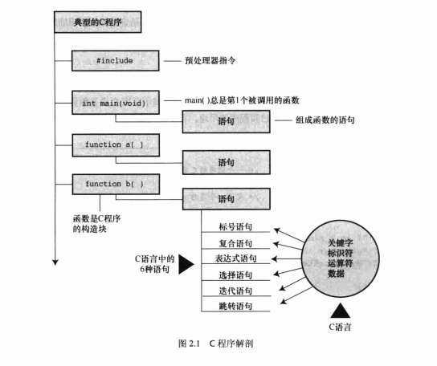
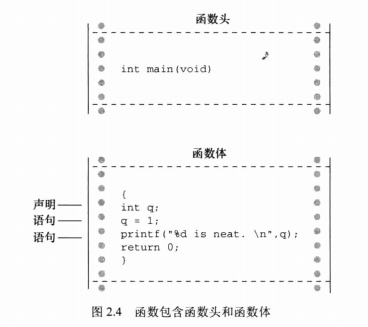

# C 语言概述

## 简单的 c 程序示例

```c
#include <stdio.h>
int main(void)                /*一个简单的C程序*/
{
    int num;                  /*定义一个名为num的变量*/
    num = 1;                  /*为num赋一个值*/
    printf("I am a simple "); /*使用printf()函数*/
    printf("computer.\n");
    printf("My favorite number is %d because it is first.\n",num);
    return 0;
}
```

输出

I am a simple computer.

My favorite number is 1 because it is first.

总而言之，结果在意料之中，但是程序中的 `\n` 和 `%d` 是什么?程序中有几行代码看起来有点奇怪。接下来，我们逐行解释这个程序



### 第1遍：快速概要

`#include<stdio.h>` <- 包含另一个文件

该行告诉编译器把 stdio.h 中的内容包含在当前程序中。stdio.h 是 C 编译器软件包的标准部分，它提供键盘输入和屏幕输出的支持。

`int main(void)` <- 函数名

C 程序包含一个或多个函数，它们是 C 程序的基本模块。

圆括号表明 main() 是一个函数名。int 表明 main() 函数返回一个整数，void 表明 main() 不带任何参数,现在只需记住 int 和 void 是标准 ANSIC 定义 main() 的一部分( 如果使用 ANSIC 之前的编译器，请省略void )

`/*一个简单的C程序*/` <- 注释

注释在/*和*/两个符号之间，这些注释能提高程序的可读性。注意，注释只是为了帮助读者理解程序，编译器会忽略它们。

`{`      <- 函数体开始

左花括号表示函数定义开始，右花括号( `}` )表示函数定义结束。

`int num;`   <- 声明

该声明表明，将使用一个名为num的变量，而且num是int(整数)类型。

`num =1;` <- 赋值表达式语句

语句 `num = 1;` 把值1赋给名为 num 的变量。

`printf("I am a simple ");` <- 调用一个函数

该语句使用 printf() 函数，在屏幕上显示 I am a simple, 光标停在同一行。

printf() 是标准的 C 库函数。在程序中使用函数叫作调用函数。

`printf("computer.\n");` <- 调用另一个函数

接下来调用的这个 printf() 函数在上条语句打印出来的内容后面加上“computer” 。

代码 `\n` 告诉计算机另起一行，即把光标移至下一行。

`printf("Ny favorite number is %d because it is first.\n",num);` <- 最后调用的printf()把num的值( 1 )内嵌在用双引号括起来的内容中一并打印。

`%d` 告诉计算机以何种形式输出 num 的值，打印在何处。

`return 0;` <- return语句

C 函数可以给调用方提供(或返回)一个数。目前，可暂时把该行看作是结束main()函数的要求。

`}` <- 结束

必须以右花括号表示程序结束。

### 第2遍：程序细节

#### 1. #include 指令和头文件

include<stdio.h>

`#include<stdio.h>` 的作用相当于把 stdio.h 文件中的所有内容都输入该行所在的位置。

`#include`这行代码是一条 C 预处理器指令(preprocessor directive)。

通常，C编译器在编译前会对源代码做一些准备工作，即预处理(preprocessing)。

所有的 C 编译器软件包都提供 stdio.h 文件。该文件中包含了供编译器使用的输入和输出函数(如，printf())信息。该文件名的含义是标准输入/输出头文件。通常，在C程序顶部的信息集合被称为头文件(header)。

ANSI/SOC规定了C编译器必须提供哪些头文件。有些程序要包含stdio.h,而有些不用。

特定C实现的文档中应该包含对C库函数的说明。这些说明确定了使用哪些函数需要包含哪些头文件。例如，要使用printf()函数，必须包含stdio.h头文件。省略必要的头文件可能不会影响某一特定程序，但是最好不要这样做。本书每次用到库函数，都会用#include指令包含ANSI/ISO标准指定的头文件。

#### 2. main() 函数

`int main(void);`

C 程序一定从 main() 函数开始执行(目前不必考虑例外的情况)。除了main()函数，你可以任意命名其他函数，而且main()函数必须是开始的函数。

int 是 main() 函数的返回类型。这表明 main() 函数返回的值是整数。返回给操作系统。

通常，函数名后面的圆括号中包含一些传入函数的信息。该例中没有传递任何信息。因此，圆括号内是单词void

如果浏览旧式的C代码，会发现程序以如下形式开始：

`main()`

C90 标准勉强接受这种形式，但是 C99 和 C11 标准不允许这样写。因此，即使你使用的编译器允许，也不要这样写。

你还会看到下面这种形式：

`void main()`

一些编译器允许这样写，但是所有的标准都未认可这种写法。因此，编译器不必接受这种形式，而且许多编译器都不能这样写。

#### 3. 注释

`/*一个简单的程序*/`

在程序中，被 `/**/` 两个符号括起来的部分是程序的注释。写注释能让他人( 包括自己 )更容易明白你所写的程序。

C 语言注释的好处之一是，可将注释放在任意的地方，甚至是与要解释的内容在同一行。较长的注释可单独放一行或多行。在 `/*` 和 `*/` 之间的内容都会被编译器忽略。

下面列出了一些有效和无效的注释形式：

```c
/*这是一条C注释... */
/*这也是一条注释，
  被分成两行。*/
/*
也可以这样写注释。
*/

/*这条注释无效，因为缺少了结束标记。
```

C99 新增了另一种风格的注释，普遍用于 C++ 和 Java。这种新风格使用    `//` 符号创建注释，仅限于单行。 `//` 这种注释只能写成一行。

`int rigue;//这种注释也可置于此。`

因为一行末尾就标志着注释的结束，所以这种风格的注释只需在注释开始处标明 `//` 符号即可。这种新形式的注释是为了解决旧形式注释存在的潜在问题。假设有下面的代码：

```c
/*
希望能运行
*/
x =100;
y =200;
/*其他内容已省略。*/
```

接下来，假设你决定删除第4行，但不小心删掉了第3行( */ )。代码如下所示：

```c
/*
希望能运行。
y =200;
/*其他内容已省略。*/
```

现在，编译器把第1行的 `/*` 和第4行的 `*/` 配对，导致4行代码全都成了注释(包括应作为代码的那一行)。而 `//` 形式的注释只对单行有效，不会导致这种“消失代码”的问题。

一些编译器可能不支持这一特性。还有一些编译器需要更改设置，才能支持 C99 或 C11 的特性。

#### 4. 花括号、函数体和块

```c
{
    ...
}
```

一般而言，所有的 C 函数都使用花括号标记函数体的开始和结束。这是规定，不能省略。只有花括号({})能起这种作用，圆括号(())和方括号([])都不行。

花括号还可以用于把函数中多条语句合并为一个单元或块

#### 5. 声明

`int num;`

声明是 C 语言最重要的特性之一。在该例中，声明完成了两件事。

其一，在函数中有一个名为 num 的变量(variable)。

其二，int 表明 num 是一个整数(即，没有小数点或小数部分的数)。

int 是一种数据类型。编译器使用这些信息为 num 变量在内存中分配存储空间。分号在 C 语言中是大部分语句和声明的一部分，不像在Pascal中只是语句间的分隔符。

int 是 C 语言的一个关键字(keyword),表示一种基本的 C 语言数据类型。关键字是语言定义的单词，不能做其他用途。例如，不能用int作为函数名和变量名。

示例中的 num 是一个标识符(identifier),也就一个变量、函数或其他实体的名称。

因此，声明把特定标识符与计算机内存中的特定位置联系起来，同时也确定了储存在某位置的信息类型或数据类型。

在 C 语言中，所有变量都必须先声明才能使用。这意味着必须列出程序中用到的所有变量名及其类型。

以前的 C 语言，还要求把变量声明在块的顶部，其他语句不能在任何声明的前面。也就是说，main() 函数体如下所示：

```c
int main()//旧规则
{
    int doors
    int dogs;
    doors =5;
    dogs =3;
    //其他语句
}
```

C99 和 C11 遵循 C++ 的惯例，可以把声明放在块中的任何位置。尽管如此，首次使用变量之前一定要先声明它。因此，如果编译器支持这一新特性，可以这样编写上面的代码：

```c
int main()
//目前的C规则
(
    //一些语句
    int doors;
    doors =5;//第1次使用doors
    //其他语句
    int dogs;
    dogs =3;//第1次使用dogs
    //其他语句
)
```

>什么是数据类型?
>如何命名?
>为何要声明变量?

##### 数据类型

C 语言可以处理多种类型的数据，如整数、字符和浮点数。把变量声明为整型或字符类型，计算机才能正确地储存、读取和解释数据。

##### 命名

给变量命名时要使用有意义的变量名或标识符(如，程序中需要一个变量数羊，该变量名应该是sheep_count而不是x3)。

如果变量名无法清楚地表达自身的用途，可在注释中进一步说明。

C99 和 C11 允许使用更长的标识符名，但是编译器只识别前63个字符。对于外部标识符,只允许使用31个字符。(以前C90只允许6个字符。旧式编译器通常最多只允许使用8个字符。)

实际上，你可以使用更长的字符，但是编译器会忽略超出的字符。也就是说，如果有两个标识符名都有63个字符，只有一个字符不同，那么编译器会识别这是两个不同的名称。如果两个标识符都是64个字符，只有最后一个字符不同，那么编译器可能将其视为同一个名称，也可能不会。标准并未定义在这种情况下会发生什么。

可以用小写字母、大写字母、数字和下划线( _ )来命名。而且，名称的第1个字符必须是**字符**或**下划线**，不能是数字,以下是一些示例

| 有效的名称 | 无效的名称 |
| --- | --- |
| wiggles | $Z]** |
| cat2 | 2cat |
| Hot_Tub | Hot-Tub |
| taxRate | tax rate |
| _kacb | don't |

操作系统和 C 库经常使用以一个或两个下划线字符开始的标识符(如，_kcab),因此最好避免在自己的程序中使用这种名称。

标准标签都以一个或两个下划线字符开始，如库标识符。这样的标识符都是保留的。这意味着，虽然使用它们没有语法错误，但是会导致名称冲突。
C语言的名称区分大小写，即把一个字母的大写和小写视为两个不同的字符。因此，stars和Stars、STARS都不同。

##### 声明变量的4个理由

- 把所有的变量放在一处，方便读者查找和理解程序的用途。如果变量名都是有意义的(如，taxtate而不是r),这样做效果很好。如果变量名无法表述清楚，在注释中解释变量的含义。这种方法让程序的可读性更高。
  
- 声明变量会促使你在编写程序之前做一些计划。程序在开始时要获得哪些信息?希望程序如何输出?表示数据最好的方式是什么?

- 声明变量有助于发现隐藏在程序中的小错误，如变量名拼写错误。例如，假设在某些不需要声明就可以直接使用变量的语言中，编写如下语句  

    `RADIUS1 = 20.4;`

    在后面的程序中，误写成：

    `CIRCUM = 6.28*RADIUSl;`

    你不小心把数字1打成小写字母 l。这些语言会创建一个新的变量RADIUSl,并使用该变量中的值(也许是0,也许是垃圾值),导致赋给CIRCUM的值是错误值。

- 如果事先未声明变量，C程序将无法通过编译。如果前几个理由还不足以说服你，这个理由总可以让你认真考虑一下了。

#### 6. 赋值

`num =1;`

赋值是 C 语言的基本操作之一。该行代码的意思是“ 把值1赋给变量 num ”。在执行 `int num;` 声明时，编译器在计算机内存中为变量 num 预留了空间，然后在执行这行赋值表达式语句时，把值储存在之前预留的位置。可以给 num 赋不同的值，这就是 num 之所以被称为变量(variable)的原因。
**注意，该赋值表达式语句从右侧把值赋到左侧。另外，该语句以分号结尾**，如
图2.2所示。


#### 7. printf(函数

```c
printf("I am a simple ");
printf("computer.\n");
printf("My favorite number is %d because it is first.\n",num);
```

这3行都使用了 C 语言的一个标准函数：printf()。圆括号表明 printf 是一个函数名。圆括号中的内容是从 main() 函数传递给 printf() 函数的信息。例如，上面的第1行把 I am a simple 传递给 printf() 函数。该信息被称为参数，或者更确切地说，是函数的实际参数(actual argument),如图2.3所示。(在C语言中，实际参数(简称实参)是传递给函数的特定值，形式参数(简称形参)是函数中用于储存值的变量)

printf()函数会查看双引号中的内容，并将其打印在屏幕上。


第1行 printf() 演示了在 C 语言中如何调用函数。只需输入函数名，把所需的参数填入圆括号即可。当程序运行到这一行时，控制权被转给已命名的函数(该例中是printf())。函数执行结束后，控制权被返回至主调函数(calling finction),该例中是 main()。

第2行 printf() 函数的双引号中的 `\n` 字符并未输出。`\n` 的意思是换行。`\n` 组合(依次输入这两个字符)代表一个换行符(newline character)。对于 printf() 而言，它的意思是“在下一行的最左边开始新的一行”。

换行符是一个转义序列(escapesequence)。转义序列用于代表难以表示或无法输入的字符。如，`\t` 代表 Tab 键，`\b` 代表Backspace键(退格键)。每个转义序列都以反斜杠字符 ( \ )开始。

第3个printf()还有一些不明之处：参数中的 `%d` 在打印时有什么作用?先来看该函数的输出：

My favorite number is 1 because it is first.

对比发现，参数中的 `%d` 被数字1代替了，而1就是变量 num 的值。`%d` 相当于是一个占位符，其作用是指明输出 num 值的位置。

### 8. return语句

`return 0;`

return 语句程序的最后一条语句。int main(void) 中的 int 表明 main() 函数应返回一个整数。C 标准要求main() 这样做。有返回值的C函数要有 return 语句。该语句以 return 关键字开始，后面是待返回的值，并以分号结尾。

如果遗漏 main() 函数中的 return 语句，程序在运行至最外面的右花括号( `}` )时会返回 0。因此，可以省略 main() 函数末尾的 return 语句。但是，不要在其他有返回值的函数中漏掉它。

## 简单程序的结构

程序由一个或多个函数组成，必须有 main() 函数。

函数由函数头和函数体组成。

函数头包括函数名、传入该函数的信息类型和函数的返回类型。通过函数名后的圆括号可识别出函数，圆括号里可能为空，可能有参数。函数体被花括号括起来，由一系列语句、声明组成。程序示例中有一条声明，声明了程序使用的变量名和类型。然后是一条赋值表达式语句，变量被赋给一个值。接下来是3条 printf() 语句,调用 printf() 函数3次。最后，main() 以 return 语句结束。



## 关键字和保留标识符

关键字是 C 语言的词汇。它们对 C 而言比较特殊，不能用它们作为标识符(如，变量名)。许多关键字用于指定不同的类型，如 int。还有一些关键字(如，if)用于控制程序中语句的执行顺序。在表2.2中所列的C语言关键字中，粗体表示的是C90标准新增的关键字，斜体表示的C99标准新增的关键字，粗斜体表示的是C11标准新增的关键字。


