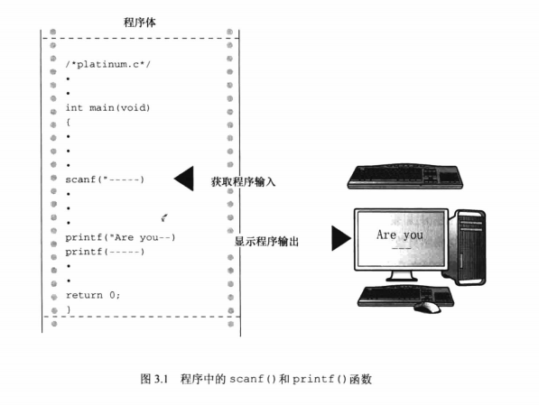
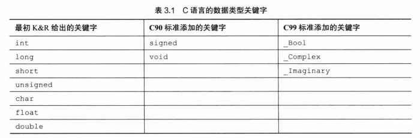
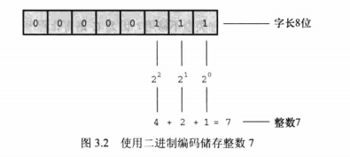
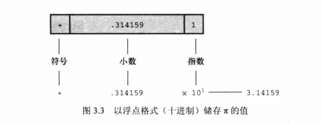
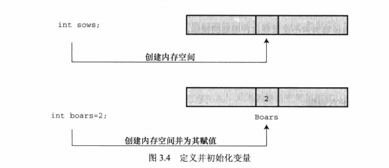

# 数据和 C

## 示例程序

platinum.c程序

```c
/*platinum.c --your weight in platinum*/
#include <stdio.h>
int main(void)
{
    float weight;   /*你的体重*/
    float value;    /*相等重量的白金价值*/
    printf("Are you worth your weight in platinum?\n");
    printf("Let's check it out.\n");
    printf("Please enter your weight in pounds:");
    /*获取用户的输入*/
    scanf("8f",&weight);
    /*假设白金的价格是每盎司$1700*/
    /*14.5833用于把英镑常衡盎司转换为金街盘司'*/
    value =1700.0*weight*14.5833;
    printf("Your weight in platinum is worth $8.2f.\n",value);
    printf("You are easily worth that!If platinum prices drop,\n");
    printf("eat more to maintain your value.\n");
    
    return 0;
}
```

输入该程序时，可以把1700.0改成贵金属白金当前的市价，但是不要改动14.5833,该数是1英镑的金衡盎司数(金衡盎司用于衡量贵金属，而英镑常衡盎司用于衡量人的体重)。

注意，“enter your weight” 的意思是输入你的体重，然后按下 Enter 或 Return 键( 不要键入体重后就一直等着 )。按下 Enter 键是告知计算机，你已完成输入数据。该程序需要你输入一个数字(如，155),而不是单词(如，too much)。如果输入字母而不是数字，会导致程序出问题。这个问题要用 if 语句来解决,因此请先输入数字。下面是程序的输出示例：

Are you worth your weight in platinum?

Let's check it out.

Please enter your weight in pounds: **156**

Your weight in platinum is worth $3867491.25.

You are easily worth that!If platinum prices drop,

eat more to maintain your value.

### 程序中的新元素

- 注意，代码中使用了一种新的变量声明。前面的例子中只使用了整数类型的变量(int),但是本例使用了浮点数类型(float)的变量，以便处理更大范围的数据。float 类型可以储存带小数的数字。

- 程序中演示了常量的几种新写法。现在可以使用带小数点的数了。

- 为了打印新类型的变量，在printf() 中使用 %f 来处理浮点值。%.2f 中的 .2 用于精确控制输出，指定输出的浮点数只显示小数点后面两位。

- scanf() 函数用于读取键盘的输入。%f 说明 scanf() 要读取用户从键盘输入的浮点数，&weight 告诉 scanf() 把输入的值赋给名为 weight 的变量。scanf() 函数使用 & 符号表明找到weight变量的地址。



## 变量与常量数据

有些数据类型在整个程序的运行过程中没有变化，这些称为常量(constant)。其他数据类型在程序运行期间可能会改变或被赋值，这些称为变量(variable)。

在示例程序中，weight 是一个变量，14.5833是一个常量。那么,1700.0是常量还是变量?在现实生活中，白金的价格不会是常量，但是在程序中，像1700.0这样的价格被视为常量。

## 数据：数据类型关键字

不仅变量和常量不同，不同的数据类型之间也有差异。一些数据类型表示数字，一些数据类型表示字母(更普遍地说是字符)。C 通过识别一些基本的数据类型来区分和使用这些不同的数据类型。

如果数据是常量，编译器一般通过用户书写的形式来识别类型(如，42是整数，42.100是浮点数)。但是，对变量而言，要在声明时指定其类型。



在 C 语言中，用 int 关键字来表示基本的整数类型。后3个关键字(long、short和unsigned)和 C90 新增的 signed 用于提供基本整数类型的变式，例如 unsigned short int 和 long long int。char 关键字用于指定字母和其他字符(如，#、$、告和*)。另外，char 类型也可以表示较小的整数。float、double 和 long double 表示带小数点的数。_Boo1 类型表示布尔值(true或false),_complex 和 Imaginary 分别表示复数和虚数。

通过这些关键字创建的类型，按计算机的储存方式可分为两大基本类型：整数类型和浮点数类型。

>位、字节和字
>
>位、字节和字是描述计算机数据单元或存储单元的术语。这里主要指存储单元。
>
>最小的存储单元是位(bit),可以储存 0 或 1 (或者说，位用于设置“开”或“关”)。虽然1位储存的信息有限，但是计算机中位的数量十分庞大。位是计算机内存的基本构建块。
>
>字节(Byte)是常用的计算机存储单位。对于几乎所有的机器，1字节均为8位。这是字节的标准定义，至少在衡量存储单位时是这样。既然1位可以表示0或1,那么8位字节就有256(2的8次方)种可能的0、1的组合。通过二进制编码(仅用0和1便可表示数字),便可表示0～255的整数或一组字符。
>
>字(word)是设计计算机时给定的自然存储单位。对于8位的微型计算机(如，最初的苹果机),1个字长只有8位。从那以后，个人计算机字长增至16位、32位，直到目前的64位。计算机的字长越大，其数据转移越快，允许的内存访问也更多。

## 整数

和数学的概念一样，在 C 语言中，整数是没有小数部分的数。例如，2、-23和2456都是整数。而3.14、0.22和2.000都不是整数。

计算机以二进制数字储存整数，例如，整数7以二进制写是111。因此，要在8位字节中储存该数字，需要把前5位都设置成0,后3位设置成1(如图3.2所示)。



## 浮点数

浮点数与数学中实数的概念差不多。2.75、3.16E7、7.00 和 2e-8 都是浮点数。注意，在一个值后面加上一个小数点，该值就成为一个浮点值。所以，7是整数，7.00是浮点数。显然，书写浮点数有多种形式。稍后将详细介绍e记数法，这里先做简要介绍：3.16E7表示3.16×10⁷( 3.16乘以10的7次方 )。其中，10⁷ = 10000000,7 被称为 10 的指数。

这里关键要理解浮点数和整数的储存方案不同。计算机把浮点数分成小数部分和指数部分来表示，而且分开储存这两部分。

因此，虽然7.00和7在数值上相同，但是它们的储存方式不同。在十进制下，可以
把7.0写成0.7E1。这里，0.7是小数部分，1是指数部分。图3.3演示了一个储存浮点数的例子。当然，计算机在内部使用二进制和2的幂进行储存，而不是10的幂。

- 整数没有小数部分，浮点数有小数部分。
- 浮点数可以表示的范围比整数大。参见本章末的表3.3。
- 对于一些算术运算(如，两个很大的数相减),浮点数损失的精度更多。

- 
- 因为在任何区间内(如，1.0到2.0之间)都存在无穷多个实数，所以计算机的浮点数不能表示区间内所有的值。浮点数通常只是实际值的近似值。例如，7.0可能被储存为浮点值6.99999。稍后会讨论更多精度方面的内容。

## C 语言基本数据类型

### int 类型

int类型是有符号整型，即int类型的值必须是整数，可以是正整数、负整数或零。其取值范围依计算机系统而异。一般而言，储存一个int要占用一个机器字长。因此，早期的16位 IBM PC 兼容机使用16位来储存一个 int 值，其取值范围(即int值的取值范围)是-32768～32767。目前的个人计算机一般是32位，因此用32位储存一个 int 值。现在，个人计算机产业正逐步向着64位处理器发展，自然能储存更大的整数。ISOC 规定int的取值范围最小为-32768～32767。

一般而言，系统用一个特殊位的值表示有符号整数的正负号。

1. 声明int变量

    先写上int,然后写变量名，最后加上一个分号。要声明多个变量，可以单独声明每个变量，也可在int后面列出多个变量名，变量名之间用逗号分隔。下面都是有效的声明：

    `int erns;int hogs,cows,goatsj`

    可以分别在4条声明中声明各变量，也可以在一条声明中声明4个变量。两种方法的效果相同，都为4个int大小的变量赋予名称并分配内存空间。

    以上声明创建了变量，但是并没有给它们提供值。变量如何获得值?前面介绍过在程序中获取值的两种途径。第1种途径是赋值：

    `cows = 112;`

    第2种途径是，通过函数(如，scanf())获得值。接下来，我们着重介绍第3种途径。

2. 初始化变量

    初始化(initialize)变量就是为变量赋一个初始值。在 C 语言中，初始化可以直接在声明中完成。只需在变量名后面加上赋值运算符(=)和待赋给变量的值即可。如下所示：

    `int hogs =21;`

    `int cows =32,goats =14;int dogs,cats =94;/*有效，但是这种格式很精糕*/`

    以上示例的最后一行，只初始化了 cats,并未初始化 dogs。这种写法很容易让人误认为 dogs 也被初始化为94,所以最好不要把初始化的变量和未初始化的变量放在同一条声明中。
    简而言之，声明为变量创建和标记存储空间，并为其指定初始值(如图3.4所示)。

    

3. int 类型常量

   上面示例中出现的整数(21、32、14和94)都是整型常量或整型字面量。C 语言把不含小数点和指数的数作为整数。因此，22和-44都是整型常量，但是22.0和2.2E1则不是。C 语言把大多数整型常量视为 int 类型，但是非常大的整数除外。

4. 打印 int 值

    可以使用 printf() 函数打印 int 类型的值。第2章中介绍过，%d 指明了在一行中打印整数的位置。%d 称为转换说明，它指定了 printf() 应使用什么格式来显示一个值。格式化字符串中的每个 %d 都与待打印变量列表中相应的 int 值匹配。这个值可以是 int 类型的变量、int 类型的常量或其他任何值为 int 类型的表达式。

    以下程序演示了一个简单的程序，程序中初始化了一个变量，并打印该变量的值、一个常量值和一个简单表达式的值。另外，程序还演示了如果粗心犯错会导致什么结果。

    ```c
    /*print1.c-演示printf()的一些特性*/
    #include <stdio.h>
    int main(void)
    {
        int ten =10;
        int two=2;
        printf("Doing it right:");
        printf("ad minus 8d is id\n",ten,2,ten -two);
        printf("Doing it wrong:");
        printf("%d minus 8d is Bd\n",ten);//遗漏2个参数

        return 0;
    }
    ```

    编译并运行该程序，输出如下：

    Doing it right:10 minus 2 is 8

    Doing it wrong:10 minus 16 is 1650287143

    在第一行输出中，第1个 %d 对应 int 类型变量 ten;第2个 %d 对应 int 类型常量2;第3个 %d 对应 int 类型表达式ten - two的值。

    在第二行输出中，第1个 %d 对应 ten 的值，但是由于没有给后两个 %d 提供任何值，所以打印出的值是内存中的任意值(读者在运行该程序时显示的这两个数值会与输出示例中的数值不同，因为内存中储存的数据不同，而且编译器管理内存的位置也不同)。
    注意,使用printf()函数时，要确保转换说明的数量与待打印值的数量相等。

5. 八进制和十六进制

    通常，C 语言都假定整型常量是十进制数。然而，许多程序员很喜欢使用八进制和十六进制数。因为8和16都是2的幂，而10却不是。显然，八进制和十六进制记数系统在表达与计算机相关的值时很方便。例如，十进制数65536经常出现在16位机中，用十六进制表示正好是10000。另外，十六进制数的每一位的数恰好由4位二进制数表示。例如，十六进制数3是0011,十六进制数5是0101。

    因此，十六进制数35的位组合(bitpattern)是00110101,十六进制数53的位组合是01010011。这种对应关系使得十六进制和二进制的转换非常方便。但是，计算机如何知道10000是十进制、十六进制还是二进制?在 C 语言中，用特定的前缀表示使用哪种进制。0x 或 0X 前缀表示十六进制值，所以十进制数16表示成十六进制是 0x10 或 0X10。与此类似，0 前缀表示八进制。例如，十进制数16表示成八进制是 020。

    要清楚，使用不同的进制数是为了方便，不会影响数被储存的方式。也就是说，无论把数字写成 16、
    020 或 0x10,储存该数的方式都相同，因为计算机内部都以二进制进行编码。

6. 显示八进制和十六进制

    在 C 程序中，既可以使用和显示不同进制的数。不同的进制要使用不同的转换说明。以十进制显示数字，使用 %d ;以八进制显示数字，使用 %o;以十六进制显示数字，使用 %x。另外，要显示各进制数的前缀0、0x 和 0x,必须分别使用 %#o、%#x、%#X。

    ```c
    /*bases.c--以十进制、入进制、十六进制打印十进制数100*/
    #include <stdio.h>
    int main(void)
    {
        int x=100;
        printf("dec =8d;octal =8o;hex =8x\n",x,x,x);
        printf("dec =td;octal =#o;hex =号#x\n",x,x,x);
    }
    return 0;
    ```

    编译并运行该程序，输出如下：

    dec =100;octal =144;hex =64

    dec =100;octal =0144;hex =0x64

    该程序以3种不同记数系统显示同一个值。printf() 函数做了相应的转换。注意，如果要在八进制和十六进制值前显示 0 和 0x 前缀，要分别在转换说明中加入#。

### 其他整数类型

初学 C 语言时，int 类型应该能满足大多数程序的整数类型需求。尽管如此，还应了解一下整型的其他形式。

C 语言提供3个附属关键字修饰基本整数类型：short、long 和 unsigned。应记住以下几点。

■ short int 类型(或者简写为 short)占用的存储空间可能比 int 类型少，常用于较小数值的场合以节省空间。与 int 类似，short 是有符号类型。

■ long int 或 long 占用的存储空间可能比 int 多，适用于较大数值的场合。与 int 类似，long 是有符号类型。
long long int 或 long long(C99 标准加入)占用的储存空间可能比 long 多，适用于更大数值的场合。该类型至少占64位。与 int 类似，long long 是有符号类型。

■ unsigned int 或 unsigned 只用于非负值的场合。这种类型与有符号类型表示的范围不同。例如，16位 unsigned int 允许的取值范围是0～65535,而不是-32768～32767。用于表示正负号的位现在用于表示另一个二进制位，所以无符号整型可以表示更大的数。

■ 在 C90 标准中，添加了 unsigned long int 或 unsigned long 和 unsigned int 或 unsignedshort 类型。C99 标准又添加了 unsigned long long int 或 unsigned long long。

■ 在任何有符号类型前面添加关键字 signed ,可强调使用有符号类型的意图。例如，short、shortint、signed short、signed short int 都表示同一种类型。

1. 声明其他整数类型

    其他整数类型的声明方式与 int 类型相同，下面列出了一些例子。不是所有的C编译器都能识别最后3条声明，最后一个例子所有的类型是 C99 标准新增的。

    long int estine;
    long johns;
    short int erns;short ribs;
    unsigned int s_count;
    unsigned players;
    unsigned long headcount;
    unsigned short yesvotes;
    long long ago;

2. 使用多种整数类型的原因

    为什么说 short 类型“可能”比 int 类型占用的空间少，long 类型“可能”比 int 类型占用的空间多?因为 C 语言只规定了short 占用的存储空间不能多于int,long 占用的存储空间不能少于 int。这样规定是为了适应不同的机器。例如，过去的一台运行 Windows 3 的机器上，int 类型和 short 类型都占16位，long 类型占32位。后来，Windows 和苹果系统都使用16位储存 short 类型，32位储存 int 类型和 1ong 类型(使用32位可以表示的整数数值超过20亿)。现在，计算机普遍使用64位处理器，为了储存64位的整数，才引入了 long long 类型。
    现在，个人计算机上最常见的设置是，long long 占64位，long 占32位，short 占16位，int 占16位或32位(依计算机的自然字长而定)。原则上，这4种类型代表4种不同的大小，但是在实际使用中，有些类型之间通常有重叠。

    C 标准对基本数据类型只规定了允许的最小大小。对于16位机，short 和 int 的最小取值范围是
    [-32767,32767];对于32位机，long 的最小取值范围是[-2147483647,2147483647]。对于 unsigned short 和 unsigned int,最小取值范围是[0,65535];对于 unsigned long,最小取值范围是[0,4294967295]。long long 类型是为了支持64位的需求，最小取值范围是[-9223372036854775807,9223372036854775807];unsigned long long 的最小取值范围是[0,18446744073709551615]。

    如果要开支票，这个数是一千八百亿亿(兆)六千七百四十四万亿零七百三十七亿零九百五十五万一千六百一十五。但是，谁会去数?

    int 类型那么多，应该如何选择?首先，考虑 unsigned 类型。这种类型的数常用于计数，因为计数不用负数。而且，unsigned 类型可以表示更大的正数。
    如果一个数超出了 int 类型的取值范围，且在 long 类型的取值范围内时，使用 long 类型。然而，对于那些 long 占用的空间比 int 大的系统，使用 long 类型会减慢运算速度。因此，如非必要，请不要使用 long 类型。另外要注意一点：如果在 long 类型和 int 类型占用空间相同的机器上编写代码，当确实需要32位的整数时，应使用 long 类型而不是 int 类型，以便把程序移植到16位机后仍然可以正常工作。类似地，如果确实需要64位的整数，应使用 long long 类型。

    如果在 int 设置为32位的系统中要使用16位的值，应使用 short 类型以节省存储空间。通常，只有当程序使用相对于系统可用内存较大的整型数组时，才需要重点考虑节省空间的问题。使用short类型的另一个原因是，计算机中某些组件使用的硬件寄存器是16位。

3. long 常量和 long long 常量

    通常，程序代码中使用的数字(如，2345)都被储存为 int 类型。如果使用1000000这样的大数字，超出了 int 类型能表示的范围，编译器会将其视为 long int 类型(假设这种类型可以表示该数字)。如果数字超出 long 可表示的最大值，编译器则将其视为 unsigned long 类型。如果还不够大，编译器则将其视为 long long 或 unsigned long long 类型(前提是编译器能识别这些类型)。

    八进制和十六进制常量被视为 int 类型。如果值太大，编译器会尝试使用 unsigned int。如果还不够大，编译器会依次使用long、unsigned long、long long 和 unsigned long long 类型。有些情况下，需要编译器以 1ong 类型储存一个小数字。例如，编程时要显式使用 IBM PC 上的内存地址时。另外，一些 C 标准函数也要求使用 long 类型的值。要把一个较小的常量作为 long 类型对待，可以在值的末尾加上l(小写的 L )或 L 后缀。使用 L 后缀更好，因为 l 看上去和数字 1 很像。因此，在 int 为16位、 long 为32位的系统中，会把 7 作为16位储存，把 7L 作为32位储存。l或 L 后缀也可用于八进制和十六进制整数，如020L和0x10L。

    类似地，在支持  long long 类型的系统中，也可以使用 ll 或 LL 后缀来表示 long long 类型的值，如 3LL。另外，u 或 U 后缀表示unsigned long long,如 5ull、10LLU、6LLU 或 9U11。
