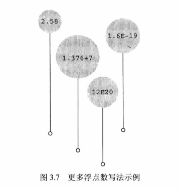

# 数据和 C

## 示例程序

platinum.c程序

```c
/*platinum.c --your weight in platinum*/
#include <stdio.h>
int main(void)
{
    float weight;   /*你的体重*/
    float value;    /*相等重量的白金价值*/
    printf("Are you worth your weight in platinum?\n");
    printf("Let's check it out.\n");
    printf("Please enter your weight in pounds:");
    /*获取用户的输入*/
    scanf("8f",&weight);
    /*假设白金的价格是每盎司$1700*/
    /*14.5833用于把英镑常衡盎司转换为金街盘司'*/
    value =1700.0*weight*14.5833;
    printf("Your weight in platinum is worth $8.2f.\n",value);
    printf("You are easily worth that!If platinum prices drop,\n");
    printf("eat more to maintain your value.\n");
    
    return 0;
}
```

输入该程序时，可以把1700.0改成贵金属白金当前的市价，但是不要改动14.5833,该数是1英镑的金衡盎司数(金衡盎司用于衡量贵金属，而英镑常衡盎司用于衡量人的体重)。

注意，“enter your weight” 的意思是输入你的体重，然后按下 Enter 或 Return 键( 不要键入体重后就一直等着 )。按下 Enter 键是告知计算机，你已完成输入数据。该程序需要你输入一个数字(如，155),而不是单词(如，too much)。如果输入字母而不是数字，会导致程序出问题。这个问题要用 if 语句来解决,因此请先输入数字。下面是程序的输出示例：

Are you worth your weight in platinum?

Let's check it out.

Please enter your weight in pounds: **156**

Your weight in platinum is worth $3867491.25.

You are easily worth that!If platinum prices drop,

eat more to maintain your value.

### 程序中的新元素

- 注意，代码中使用了一种新的变量声明。前面的例子中只使用了整数类型的变量(int),但是本例使用了浮点数类型(float)的变量，以便处理更大范围的数据。float 类型可以储存带小数的数字。

- 程序中演示了常量的几种新写法。现在可以使用带小数点的数了。

- 为了打印新类型的变量，在printf() 中使用 %f 来处理浮点值。%.2f 中的 .2 用于精确控制输出，指定输出的浮点数只显示小数点后面两位。

- scanf() 函数用于读取键盘的输入。%f 说明 scanf() 要读取用户从键盘输入的浮点数，&weight 告诉 scanf() 把输入的值赋给名为 weight 的变量。scanf() 函数使用 & 符号表明找到weight变量的地址。


## 变量与常量数据

有些数据类型在整个程序的运行过程中没有变化，这些称为常量(constant)。其他数据类型在程序运行期间可能会改变或被赋值，这些称为变量(variable)。

在示例程序中，weight 是一个变量，14.5833是一个常量。那么,1700.0是常量还是变量?在现实生活中，白金的价格不会是常量，但是在程序中，像1700.0这样的价格被视为常量。

## 数据：数据类型关键字

不仅变量和常量不同，不同的数据类型之间也有差异。一些数据类型表示数字，一些数据类型表示字母(更普遍地说是字符)。C 通过识别一些基本的数据类型来区分和使用这些不同的数据类型。

如果数据是常量，编译器一般通过用户书写的形式来识别类型(如，42是整数，42.100是浮点数)。但是，对变量而言，要在声明时指定其类型。


在 C 语言中，用 int 关键字来表示基本的整数类型。后3个关键字(long、short和unsigned)和 C90 新增的 signed 用于提供基本整数类型的变式，例如 unsigned short int 和 long long int。char 关键字用于指定字母和其他字符(如，#、$、告和*)。另外，char 类型也可以表示较小的整数。float、double 和 long double 表示带小数点的数。_Boo1 类型表示布尔值(true或false),_complex 和 Imaginary 分别表示复数和虚数。

通过这些关键字创建的类型，按计算机的储存方式可分为两大基本类型：整数类型和浮点数类型。

>位、字节和字
>
>位、字节和字是描述计算机数据单元或存储单元的术语。这里主要指存储单元。
>
>最小的存储单元是位(bit),可以储存 0 或 1 (或者说，位用于设置“开”或“关”)。虽然1位储存的信息有限，但是计算机中位的数量十分庞大。位是计算机内存的基本构建块。
>
>字节(Byte)是常用的计算机存储单位。对于几乎所有的机器，1字节均为8位。这是字节的标准定义，至少在衡量存储单位时是这样。既然1位可以表示0或1,那么8位字节就有256(2的8次方)种可能的0、1的组合。通过二进制编码(仅用0和1便可表示数字),便可表示0～255的整数或一组字符。
>
>字(word)是设计计算机时给定的自然存储单位。对于8位的微型计算机(如，最初的苹果机),1个字长只有8位。从那以后，个人计算机字长增至16位、32位，直到目前的64位。计算机的字长越大，其数据转移越快，允许的内存访问也更多。

## 整数

和数学的概念一样，在 C 语言中，整数是没有小数部分的数。例如，2、-23和2456都是整数。而3.14、0.22和2.000都不是整数。

计算机以二进制数字储存整数，例如，整数7以二进制写是111。因此，要在8位字节中储存该数字，需要把前5位都设置成0,后3位设置成1(如图3.2所示)。


## 浮点数

浮点数与数学中实数的概念差不多。2.75、3.16E7、7.00 和 2e-8 都是浮点数。注意，在一个值后面加上一个小数点，该值就成为一个浮点值。所以，7是整数，7.00是浮点数。显然，书写浮点数有多种形式。稍后将详细介绍e记数法，这里先做简要介绍：3.16E7表示3.16×10⁷( 3.16乘以10的7次方 )。其中，10⁷ = 10000000,7 被称为 10 的指数。

这里关键要理解浮点数和整数的储存方案不同。计算机把浮点数分成小数部分和指数部分来表示，而且分开储存这两部分。

因此，虽然7.00和7在数值上相同，但是它们的储存方式不同。在十进制下，可以
把7.0写成0.7E1。这里，0.7是小数部分，1是指数部分。图3.3演示了一个储存浮点数的例子。当然，计算机在内部使用二进制和2的幂进行储存，而不是10的幂。

- 整数没有小数部分，浮点数有小数部分。
- 浮点数可以表示的范围比整数大。参见本章末的表3.3。
- 对于一些算术运算(如，两个很大的数相减),浮点数损失的精度更多。

- 
- 因为在任何区间内(如，1.0到2.0之间)都存在无穷多个实数，所以计算机的浮点数不能表示区间内所有的值。浮点数通常只是实际值的近似值。例如，7.0可能被储存为浮点值6.99999。稍后会讨论更多精度方面的内容。

## C 语言基本数据类型

### int 类型

int类型是有符号整型，即int类型的值必须是整数，可以是正整数、负整数或零。其取值范围依计算机系统而异。一般而言，储存一个int要占用一个机器字长。因此，早期的16位 IBM PC 兼容机使用16位来储存一个 int 值，其取值范围(即int值的取值范围)是-32768～32767。目前的个人计算机一般是32位，因此用32位储存一个 int 值。现在，个人计算机产业正逐步向着64位处理器发展，自然能储存更大的整数。ISOC 规定int的取值范围最小为-32768～32767。

一般而言，系统用一个特殊位的值表示有符号整数的正负号。

1. 声明int变量

    先写上int,然后写变量名，最后加上一个分号。要声明多个变量，可以单独声明每个变量，也可在int后面列出多个变量名，变量名之间用逗号分隔。下面都是有效的声明：

    `int erns;int hogs,cows,goatsj`

    可以分别在4条声明中声明各变量，也可以在一条声明中声明4个变量。两种方法的效果相同，都为4个int大小的变量赋予名称并分配内存空间。

    以上声明创建了变量，但是并没有给它们提供值。变量如何获得值?前面介绍过在程序中获取值的两种途径。第1种途径是赋值：

    `cows = 112;`

    第2种途径是，通过函数(如，scanf())获得值。接下来，我们着重介绍第3种途径。

2. 初始化变量

    初始化(initialize)变量就是为变量赋一个初始值。在 C 语言中，初始化可以直接在声明中完成。只需在变量名后面加上赋值运算符(=)和待赋给变量的值即可。如下所示：

    `int hogs =21;`

    `int cows =32,goats =14;int dogs,cats =94;/*有效，但是这种格式很精糕*/`

    以上示例的最后一行，只初始化了 cats,并未初始化 dogs。这种写法很容易让人误认为 dogs 也被初始化为94,所以最好不要把初始化的变量和未初始化的变量放在同一条声明中。
    简而言之，声明为变量创建和标记存储空间，并为其指定初始值(如图3.4所示)。

    

3. int 类型常量

   上面示例中出现的整数(21、32、14和94)都是整型常量或整型字面量。C 语言把不含小数点和指数的数作为整数。因此，22和-44都是整型常量，但是22.0和2.2E1则不是。C 语言把大多数整型常量视为 int 类型，但是非常大的整数除外。

4. 打印 int 值

    可以使用 printf() 函数打印 int 类型的值。第2章中介绍过，%d 指明了在一行中打印整数的位置。%d 称为转换说明，它指定了 printf() 应使用什么格式来显示一个值。格式化字符串中的每个 %d 都与待打印变量列表中相应的 int 值匹配。这个值可以是 int 类型的变量、int 类型的常量或其他任何值为 int 类型的表达式。

    以下程序演示了一个简单的程序，程序中初始化了一个变量，并打印该变量的值、一个常量值和一个简单表达式的值。另外，程序还演示了如果粗心犯错会导致什么结果。

    ```c
    /*print1.c-演示printf()的一些特性*/
    #include <stdio.h>
    int main(void)
    {
        int ten =10;
        int two=2;
        printf("Doing it right:");
        printf("ad minus 8d is id\n",ten,2,ten -two);
        printf("Doing it wrong:");
        printf("%d minus 8d is Bd\n",ten);//遗漏2个参数

        return 0;
    }
    ```

    编译并运行该程序，输出如下：

    Doing it right:10 minus 2 is 8

    Doing it wrong:10 minus 16 is 1650287143

    在第一行输出中，第1个 %d 对应 int 类型变量 ten;第2个 %d 对应 int 类型常量2;第3个 %d 对应 int 类型表达式ten - two的值。

    在第二行输出中，第1个 %d 对应 ten 的值，但是由于没有给后两个 %d 提供任何值，所以打印出的值是内存中的任意值(读者在运行该程序时显示的这两个数值会与输出示例中的数值不同，因为内存中储存的数据不同，而且编译器管理内存的位置也不同)。
    注意,使用printf()函数时，要确保转换说明的数量与待打印值的数量相等。

5. 八进制和十六进制

    通常，C 语言都假定整型常量是十进制数。然而，许多程序员很喜欢使用八进制和十六进制数。因为8和16都是2的幂，而10却不是。显然，八进制和十六进制记数系统在表达与计算机相关的值时很方便。例如，十进制数65536经常出现在16位机中，用十六进制表示正好是10000。另外，十六进制数的每一位的数恰好由4位二进制数表示。例如，十六进制数3是0011,十六进制数5是0101。

    因此，十六进制数35的位组合(bitpattern)是00110101,十六进制数53的位组合是01010011。这种对应关系使得十六进制和二进制的转换非常方便。但是，计算机如何知道10000是十进制、十六进制还是二进制?在 C 语言中，用特定的前缀表示使用哪种进制。0x 或 0X 前缀表示十六进制值，所以十进制数16表示成十六进制是 0x10 或 0X10。与此类似，0 前缀表示八进制。例如，十进制数16表示成八进制是 020。

    要清楚，使用不同的进制数是为了方便，不会影响数被储存的方式。也就是说，无论把数字写成 16、
    020 或 0x10,储存该数的方式都相同，因为计算机内部都以二进制进行编码。

6. 显示八进制和十六进制

    在 C 程序中，既可以使用和显示不同进制的数。不同的进制要使用不同的转换说明。以十进制显示数字，使用 %d ;以八进制显示数字，使用 %o;以十六进制显示数字，使用 %x。另外，要显示各进制数的前缀0、0x 和 0x,必须分别使用 %#o、%#x、%#X。

    ```c
    /*bases.c--以十进制、入进制、十六进制打印十进制数100*/
    #include <stdio.h>
    int main(void)
    {
        int x=100;
        printf("dec =8d;octal =8o;hex =8x\n",x,x,x);
        printf("dec =td;octal =#o;hex =号#x\n",x,x,x);
    }
    return 0;
    ```

    编译并运行该程序，输出如下：

    dec =100;octal =144;hex =64

    dec =100;octal =0144;hex =0x64

    该程序以3种不同记数系统显示同一个值。printf() 函数做了相应的转换。注意，如果要在八进制和十六进制值前显示 0 和 0x 前缀，要分别在转换说明中加入#。

### 其他整数类型

初学 C 语言时，int 类型应该能满足大多数程序的整数类型需求。尽管如此，还应了解一下整型的其他形式。

C 语言提供3个附属关键字修饰基本整数类型：short、long 和 unsigned。应记住以下几点。

- short int 类型(或者简写为 short)占用的存储空间可能比 int 类型少，常用于较小数值的场合以节省空间。与 int 类似，short 是有符号类型。

- long int 或 long 占用的存储空间可能比 int 多，适用于较大数值的场合。与 int 类似，long 是有符号类型。
long long int 或 long long(C99 标准加入)占用的储存空间可能比 long 多，适用于更大数值的场合。该类型至少占64位。与 int 类似，long long 是有符号类型。

- unsigned int 或 unsigned 只用于非负值的场合。这种类型与有符号类型表示的范围不同。例如，16位 unsigned int 允许的取值范围是0～65535,而不是-32768～32767。用于表示正负号的位现在用于表示另一个二进制位，所以无符号整型可以表示更大的数。

- 在 C90 标准中，添加了 unsigned long int 或 unsigned long 和 unsigned int 或 unsignedshort 类型。C99 标准又添加了 unsigned long long int 或 unsigned long long。

- 在任何有符号类型前面添加关键字 signed ,可强调使用有符号类型的意图。例如，short、shortint、signed short、signed short int 都表示同一种类型。

1. 声明其他整数类型

    其他整数类型的声明方式与 int 类型相同，下面列出了一些例子。不是所有的C编译器都能识别最后3条声明，最后一个例子所有的类型是 C99 标准新增的。

    long int estine;
    long johns;
    short int erns;short ribs;
    unsigned int s_count;
    unsigned players;
    unsigned long headcount;
    unsigned short yesvotes;
    long long ago;

2. 使用多种整数类型的原因

    为什么说 short 类型“可能”比 int 类型占用的空间少，long 类型“可能”比 int 类型占用的空间多?因为 C 语言只规定了short 占用的存储空间不能多于int,long 占用的存储空间不能少于 int。这样规定是为了适应不同的机器。例如，过去的一台运行 Windows 3 的机器上，int 类型和 short 类型都占16位，long 类型占32位。后来，Windows 和苹果系统都使用16位储存 short 类型，32位储存 int 类型和 1ong 类型(使用32位可以表示的整数数值超过20亿)。现在，计算机普遍使用64位处理器，为了储存64位的整数，才引入了 long long 类型。
    现在，个人计算机上最常见的设置是，long long 占64位，long 占32位，short 占16位，int 占16位或32位(依计算机的自然字长而定)。原则上，这4种类型代表4种不同的大小，但是在实际使用中，有些类型之间通常有重叠。

    C 标准对基本数据类型只规定了允许的最小大小。对于16位机，short 和 int 的最小取值范围是[-32767,32767];对于32位机，long 的最小取值范围是[-2147483647,2147483647]。对于 unsigned short 和 unsigned int,最小取值范围是[0,65535];对于 unsigned long,最小取值范围是[0,4294967295]。long long 类型是为了支持64位的需求，最小取值范围是[-9223372036854775807,9223372036854775807];unsigned long long 的最小取值范围是[0,18446744073709551615]。

    如果要开支票，这个数是一千八百亿亿(兆)六千七百四十四万亿零七百三十七亿零九百五十五万一千六百一十五。但是，谁会去数?

    int 类型那么多，应该如何选择?首先，考虑 unsigned 类型。这种类型的数常用于计数，因为计数不用负数。而且，unsigned 类型可以表示更大的正数。

    如果一个数超出了 int 类型的取值范围，且在 long 类型的取值范围内时，使用 long 类型。然而，对于那些 long 占用的空间比 int 大的系统，使用 long 类型会减慢运算速度。因此，如非必要，请不要使用 long 类型。另外要注意一点：如果在 long 类型和 int 类型占用空间相同的机器上编写代码，当确实需要32位的整数时，应使用 long 类型而不是 int 类型，以便把程序移植到16位机后仍然可以正常工作。类似地，如果确实需要64位的整数，应使用 long long 类型。

    如果在 int 设置为32位的系统中要使用16位的值，应使用 short 类型以节省存储空间。通常，只有当程序使用相对于系统可用内存较大的整型数组时，才需要重点考虑节省空间的问题。使用short类型的另一个原因是，计算机中某些组件使用的硬件寄存器是16位。

3. long 常量和 long long 常量

    通常，程序代码中使用的数字(如，2345)都被储存为 int 类型。如果使用1000000这样的大数字，超出了 int 类型能表示的范围，编译器会将其视为 long int 类型(假设这种类型可以表示该数字)。如果数字超出 long 可表示的最大值，编译器则将其视为 unsigned long 类型。如果还不够大，编译器则将其视为 long long 或 unsigned long long 类型(前提是编译器能识别这些类型)。

    八进制和十六进制常量被视为 int 类型。如果值太大，编译器会尝试使用 unsigned int。如果还不够大，编译器会依次使用long、unsigned long、long long 和 unsigned long long 类型。有些情况下，需要编译器以 1ong 类型储存一个小数字。例如，编程时要显式使用 IBM PC 上的内存地址时。另外，一些 C 标准函数也要求使用 long 类型的值。要把一个较小的常量作为 long 类型对待，可以在值的末尾加上l(小写的 L )或 L 后缀。使用 L 后缀更好，因为 l 看上去和数字 1 很像。因此，在 int 为16位、 long 为32位的系统中，会把 7 作为16位储存，把 7L 作为32位储存。l或 L 后缀也可用于八进制和十六进制整数，如020L和0x10L。

    类似地，在支持  long long 类型的系统中，也可以使用 ll 或 LL 后缀来表示 long long 类型的值，如 3LL。另外，u 或 U 后缀表示unsigned long long,如 5ull、10LLU、6LLU 或 9U11。

    >整数溢出
    >
    >如果整数超出了相应类型的取值范围会怎样?下面分别将有符号类型和无符号类型的整数设置比最大值略大，看看会发生什么(printf()函数使用8u说明显示unsigned int类型的值)。

    ```c
    /*toobig.c--超出系统允许的最大int值*/
    #include <stdio.h>
    int main(void)
    {
        int i = 2147483647;
        unsigned int j = 4294967295;
        printf("%d %d %d\n",i,i+1,i+2);
        printf("%u %u %u\n",j,j+1,j+2);

        return 0;
    }
    ```

    在我们的系统下输出的结果是：

    2147483647 -2147483648 -2147483647

    4294967295    0    1

    可以把无符号整数 j 看作是汽车的里程表。当达到它能表示的最大值时，会重新从起始点开始。整数i也是类似的情况。它们主要的区别是，在超过最大值时，unsigned int 类型的变量 j 从0开始；而 int 类型的变量i则从-2147483648开始。注意，当 i 超出(溢出)其相应类型所能表示的最大值时，系统并未通知用户。因此，在编程时必须自己注意这类问题。

    溢出行为是未定义的行为，C 标准并未定义有符号类型的溢出规则。以上描述的溢出行为比较有代表性，但是也可能会出现其他情况。
4. 打印short、long、long long 和 unsigned 类型

    打印 unsigned int 类型的值，使用 %u 转换说明；打印 long 类型的值，使用 %ld 转换说明。如果系统中 int 和 long 的大小相同，使用 %d 就行。但是，这样的程序被移植到其他系统(int 和 long 类型大小不同)中会无法正常工作。在 x 和 o 前面可以使用 l 前缀，%lx 表示以十六进制格式打印 long 类整数，%lo 表示以八进制格式打印 long 类型整数。注意，虽然 C 允许使用大写或小写的常量后缀，但在转换说明中只能用小写。

    C 语言有多种 printf() 格式。对于 short 类型，可以使用 h 前缀。%hd 表示以十进制显示 short 型的整数，%ho 表示以八进制显示 short 类型的整数。h 和 l 前缀都可以和 u 一起使用，用于表示无符类型。

    例如，%lu 表示打印 unsigned long 类型的值。

    ```c
    /*print2.c--更多printf()的特性*/
    #include <stdio.h>
    int main(void)
    {
        unsigned int un = 3000000000;/*int为32位和short为16位的系统*/
        short end = 200;
        long big = 65537;
        long long verybig = 12345678908642;
        printf("un = %u and not %d\n",un,un);
        printf("end = %hd and %d\n",end,end);
        printf("big =%ld and not %hd\n",big,big);
        printf("verybig= %1ld and not %ld\n",verybig,verybig);
        
        return 0;
    }
    ```

    在特定的系统中输出如下(输出的结果可能不同):

    un = 3000000000 and not -1294967296

    end = 200 and 200

    big= 65537 and not 1

    verybig = 12345678908642 and not 1942899938

    该例表明，使用错误的转换说明会得到意想不到的结果。

    第1行输出，对于无符号变量un,使用 %d 会生成负值!其原因是，无符号值3000000000和有符号值-129496296在系统内存中的内部表示完全相同。因此，如果告诉 printf() 该数是无符号数，它打印一个值；如果告诉它该数是有符号数，它将打印另一个值。在待打印的值大于有符号值的最大值时，会发生这种情况。对于较小的正数(如96),有符号和无符号类型的存储、显示都相同。

    第2行输出，对于 short 类型的变量 end,在 printf() 中无论指定以 short 类型(%hd)还是 int 类型(%d)打印，打印出来的值都相同。这是因为在给函数传递参数时，C 编译器把 short 类型的值自动转换成int类型的值。你可能会提出疑问：为什么要进行转换? h 修饰符有什么用?第1个问题的答案是， int 类型被认为是计算机处理整数类型时最高效的类型。

    因此，在 short 和 int 类型的大小不同的计算机中，用int类型的参数传递速度更快。第2个问题的答案是，使用 h 修饰符可以显示较大整数被截断成 short 类型值的情况。第3行输出就演示了这种情况。把65537以二进制格式写成一个32位数是 0000000000000010000000000000001。使用 %hd,printf() 只会查看后16位，所以显示的值是1。与此类似，输出的最后一行先显示了 verybig 的完整值，然后由于使用了 %ld,printf() 只显示了储存在后32位的值。

### char 类型

char 类型用于储存字符(如，字母或标点符号),但是从技术层面看，char 是整数类型。因为 char 类型实际上储存的是整数而不是字符。计算机使用数字编码来处理字符，即用特定的整数表示特定的字符。

美国最常用的编码是 ASCII 编码，本书也使用此编码。例如，在 ASCII 码中，整数65代表大写字母 A。因此，储存字母 A 实际上储存的是整数65(许多 IBM 的大型主机使用另一种编码 EBCDIC,其原理相同。另外，其他国家的计算机系统可能使用完全不同的编码)。

标准 ASCII 码的范围是0～127,只需7位二进制数即可表示。通常，char 类型被定义为8位的存储单元，因此容纳标准 ASCII 码绰绰有余。许多其他系统(如 IMB PC 和苹果 Macs)还提供扩展 ASCII 码，也在8位的表示范围之内。一般而言，C 语言会保证 char 类型足够大，以储存系统(实现 C 语言的系统)的基本字符集。

许多字符集都超过了127,甚至多于255。例如，日本汉字(kanji)字符集。商用的统一码(Unicode)创建了一个能表示世界范围内多种字符集的系统，目前包含的字符已超过110000个。国际标准化组织(ISO)和国际电工技术委员会(IEC)为字符集开发了 ISO/IEC 10646 标准。统一码标准也与 ISO/IEC 10646 标准兼容。

C 语言把1字节定义为 char 类型占用的位(bit)数，因此无论是16位还是32位系统，都可以使用 char 类型。

1. 声明 char 类型变量

    char 类型变量的声明方式与其他类型变量的声明方式相同。下面是一些例子：

    char response;

    char itable,latan;

    以上声明创建了3个 char 类型的变量：response、itable 和 latan。

2. 字符常量和初始化

    如果要把一个字符常量初始化为字母 A,不必背下 ASCII 码，用计算机语言很容易做到。通过以下初始化把字母 A 赋给 grade 即可：

    `char grade ='A';`

    在 C 语言中，用单引号括起来的单个字符被称为宇符常量(character constant)。编译器一发现 'A',就会将其转换成相应的代码值。单引号必不可少。

    ```C
    char broiled;   /*声明一个char类型的变量*/
    broiled ='T';   /*为其赋值，正确*/
    broiled =T;     /*错误!此时T是一个变量*/
    broiled ="T";   /*错误!此时"T"是一个字符串*/
    ```

    如上所示，如果省略单引号，编译器认为 T 是一个变量名;如果把 T 用双引号括起来，编译器则认为"T"是一个字符串。

    实际上，字符是以数值形式储存的，所以也可使用数字代码值来赋值：

    `char grade =65;/*对于ASCII,这样做没问题，但这是一种不好的编程风格*/`

    在本例中，虽然65是 int 类型，但是它在 char 类型能表示的范围内，所以将其赋值给 grade 没问题。由于65是字母 A 对应的 ASCII 码，因此本例是把 A 赋给 grade。注意，能这样做的前提是系统使用 ASCII 码。其实，用 A 代替65才是较为妥当的做法，这样在任何系统中都不会出问题。因此，最好使用字符常量，而不是数字代码值。
    奇怪的是，C 语言将字符常量视为 int 类型而非 char 类型。例如，在 int 为32位、char 为8位的 ASCII 系统中，有下面的代码：

    `char grade ='B';`

    本来 'B' 对应的数值66储存在32位的存储单元中，现在却可以储存在8位的存储单元中(grade)。利用字符常量的这种特性，可以定义一个字符常量 'FATE' ,即把4个独立的8位 ASCII 码储存在一个32位存储单元中。如果把这样的字符常量赋给 char 类型变量 grade,只有最后8位有效。因此，grade 的值是 'E'。

3. 非打印字符

    单引号只适用于字符、数字和标点符号，浏览 ASCII 表会发现，有些 ASCII 字符打印不出来。例如，一些代表行为的字符(如，退格、换行、终端响铃或蜂鸣)。C 语言提供了3种方法表示这些字符。

    第1种方法前面介绍过——使用 ASCII 码。例如，蜂鸣字符的 ASCII 值是7,因此可以这样写：
    char beep -7;

    第2种方法是，使用特殊的符号序列表示一些特殊的字符。这些符号序列叫作转义序列(escapesequence)。表3.2列出了转义序列及其含义。

    `char nerf = '\n'`  

    `\n` 意思是另起一行

    

    表3.2中的最后两个转义序列(\0oo和\xhh)是 ASCII 码的特殊表示。如果要用八进制 ASCII 码表示一个字符，可以在编码值前面加一个反斜杠(\)并用单引号括起来。例如，如果编译器不识别警报字符
    (\a),可以使用 ASCII码来代替：

    `beep ='\007';`

    可以省略前面的 0,'\07' 甚至'\7' 都可以。即使没有前缀0,编译器在处理这种写法时，仍会解释为八进制。

    从 C90 开始，不仅可以用十进制、八进制形式表示字符常量，C 语言还提供了第3种选择——用十六进制形式表示字符常量，即反斜杠后面跟一个 x 或 X ,再加上1~3位十六进制数字。例如，Ctrl+P 字符的 ASCII 十六进制码是10(相当于十进制的16),可表示为 '\x10' 或 '\x010' 。图3.5列出了一些整数类型的不同进制形式

    

    使用 ASCII 码时，注意数字和数字字符的区别。例如，字符4对应的 ASCII 码是52。'4' 表示字符 4,
    而不是数值4。

4. 打印字符

    printf() 函数用 %c 指明待打印的字符。前面介绍过，一个字符变量实际上被储存为1字节的整数值。因此，如果用 %d 转换说明打印 char 类型变量的值，打印的是一个整数。而 %c 转换说明告诉 printf() 打印该整数值对应的字符。

    ```c
    #include <stdio.h>
    int main(void)
    {
        char ch;
        printf("Please enter a character.\n");
        scanf("%c",&ch);  /*用户输入字符*/
        printf("The code for %c is %d.\n",ch,ch);

        return 0;
    }
    ```

    运行该程序后，输出示例如下：

    Please enter a character.

    **C**

    The code for C is 67.

    运行该程序时，在输入字母后不要忘记按下 Enter 或 Return 键。随后，scanf() 函数会读取用户输入的字符，& 符号表示把输入的字符赋给变量 ch。接着，printf() 函数打印 ch 的值两次，第1次打印一个字符(对应代码中的 %c),第2次打印一个十进制整数值(对应代码中的%d)。注意，printf() 函数中的转换说明决定了数据的显示方式，而不是数据的储存方式(见图3.6)。

    

### _Bool 类型

C99 标准添加了 _Bool 类型，用于表示布尔值，即逻辑值 true 和 false。因为 C 语言用值1表示 true,值0表示 false,所以 Bool 类型实际上也是一种整数类型。但原则上它仅占用1位存储空间，因为对0和1而言，1位的存储空间足够了。

### 可移植类型：stdint.h 和 inttypes.h

C 语言提供了许多有用的整数类型。但是，某些类型名在不同系统中的功能不一样。C99 新增了两个头文件 stdint.h 和 inttypes.h,以确保 C 语言的类型在各系统中的功能相同。

C 语言为现有类型创建了更多类型名。这些新的类型名定义在 stdint.h 头文件中。例如，int32_t 表示32位的有符号整数类型。在使用32位 int 的系统中，头文件会把int32_t作为int 的别名。不同的系统也可以定义相同的类型名。例如，int 为16位、long 为32位的系统会把 int32_t 作为 long 的别名。然后，使用 int32_t 类型编写程序，并包含 stdint.h 头文件时，编译器会把 int 或 long 替换成与当前系统匹配的类型。

```c
/*altnames.c --可移植整数类型名*/
#include <stdio.h>
#include <inttypes.h>//支持可移植类型
int main(void){
    int32_t me32;
    //me32是一个32位有符号整型变量
    me32 = 45933945;
    printf("First,assume int32_t is int:");
    printf("me32 = %d\n",me32);
    printf("Next,let's not make any assumptions.\n");
    printf("Instead,use a \"macro\"from inttypes.h:");
    printf("me32=%" PRId32 "\n",me32);

    return 0;
}
```

该程序最后一个 printf() 中，参数 PRId32 被定义在 inttypes.h 中的 "d" 替换，因而这条语句等价于：

printf("me16 = %" "d" "\n",me16);

在 C 语言中，可以把多个连续的字符串组合成一个字符串，所以这条语句又等价于：

printf("me16 = %d \n",me16);

下面是该程序的输出，注意，程序中使用了 `\"`转义序列来显示双引号：
First,assume int32_t is int:me32 = 45933945

Next,let's not make any assumptions.

Instead,use a "macro" from inttypes.h:me32 = 45933945

### float、double 和 long double

各种整数类型对大多数软件开发项目而言够用了。然而，面向金融和数学的程序经常使用浮点数。C 语言中的浮点类型有 float、double 和 long double 类型。它们与 FORTRAN 和 Pascal 中的 real 类型一致。前面提到过，浮点类型能表示包括小数在内更大范围的数。浮点数的表示类似于科学记数法(即用小数乘以10的幂来表示数字)。该记数系统常用于表示非常大或非常小的数。


C 标准规定，float 类型必须至少能表示 6 位有效数字，且取值范围至少是 10-37～10+37。前一项规定指 float 类型必须至少精确表示小数点后的6位有效数字，如 33.333333。后一项规定用于方便地表示诸

如太阳质量 ( 2.0e30 千克) 、一个质子的电荷量 ( 1.6e-19 库仑 ) 或国家债务之类的数字。通常，系统储存一个浮点数要占用 32 位。其中8位用于表示指数的值和符号，剩下 24 位用于表示非指数部分 ( 也叫作尾数或有效数 ) 及其符号。



1. 声明浮点型变量

    浮点型变量的声明和初始化方式与整型变量相同，下面是一些例子：

    `float noah,jonah;`

    `double trouble;`

    `float planck=6.63e-34;`

    `long double gnp;`

2. 浮点型常量

    在代码中，可以用多种形式书写浮点型常量。浮点型常量的基本形式是：有符号的数字 ( 包括小数点 ),后面紧跟 e 或 E,最后是一个有符号数表示 10 的指数。下面是两个有效的浮点型常量：

    -1.56E+12

    2.87e-3

    正号可以省略。可以没有小数点 ( 如，2E5 ) 或指数部分 ( 如，19.28 ),但是不能同时省略两者。可以省略小数部分 ( 如，3.E16 ) 或整数部分 ( 如，.45E-6 ) ,但是不能同时省略两者。

    `3.14159`

    `.2`

    `4e16`

    `.8E-5`

    `100.`

    不要在浮点型常量中间加空格：1.56 E+12 ( 错误! ),
    默认情况下，编译器假定浮点型常量是 double 类型的精度。例如，假设 some 是 float 类型的变量，编写下面的语句：

    `some =4.0*2.0;`

    通常，4.0 和 2.0 被储存为 64 位的 double 类型，使用双精度进行乘法运算，然后将乘积截断成 float 类型的宽度。这样做虽然计算精度更高，但是会减慢程序的运行速度。

    在浮点数后面加上 f 或 F 后缀可覆盖默认设置，编译器会将浮点型常量看作 float 类型，如 2.3f 和 9.11E9F。使用 l 或 L 后缀使得数字成为 long double 类型，如 54.3l 和 4.32L。注意，建议使用 L 后缀，因为字母 l 和数字 1 很容易混淆。没有后缀的浮点型常量是 double 类型。

3. 打印浮点值

    printf() 函数使用 %f 转换说明打印十进制记数法的 float 和 double 类型浮点数，用 %e 打印指数记数法的浮点数。如果系统支持十六进制格式的浮点数，可用 a 和 A 分别代替 e 和 E 。打印 long double 类型要使用 %Lf、%Le 或 %La 转换说明。给那些未在函数原型中显式说明参数类型的函数 ( 如，printf() ) 传递参数时，C 编译器会把 float 类型的值自动转换成 double 类型。

    ```c
    /*showf_pt.c --以两种方式显示float类型的值*/
    #include <stdio.h>
    int main(void)
    {
        float aboat = 32000.0;
        double abet = 2.14e9;
        long double dip = 5.32e-5;

        printf("%f can be written %e\n",aboat,aboat);
        //下一行要求编译器支持C99或其中的相关特性
        printf("And it's %a in hexadecimal,powers of 2 notation\n",aboat);
        printf("%f can be written %e\n",abet,abet);
        printf("%Lf can be written %Le\n",dip,dip);
        return 0;
    }

    ```

    该程序的输出如下，前提是编译器支持C99/C11:

    32000.000000 can be written 3.200000e+04

    And it's 0x1.f4p+14 in hexadecimal,powers of 2 notation

    2140000000.000000 can be written 2.140000e+09

    0.000053 can be written 5.320000e-05

4. 浮点值的上溢和下溢

    假设系统的最大 float 类型值是 3.4E38,编写如下代码：

    ```c
    float toobig = 3.4E38*100.0f;

    printf("8e\n",toobig);
    ```

    这是一个上溢 ( overflow ) 的示例。当计算导致数字过大，超过当前类型能表达的范围时，就会发生上溢。C语言规定，在这种情况下会给 toobig 赋一个表示*无穷大*的特定值，而且 printf() 显示该值为 inf 或 infinity ( 或者具有无穷含义的其他内容 )。

    当除以一个很小的数时，情况更为复杂。回忆一下，float 类型的数以指数和尾数部分来储存。存在这样一个数，它的指数部分是最小值，即由全部可用位表示的最小尾数值。该数字是 float 类型能用全部精度表示的最小数字。现在把它除以2。通常，这个操作会减小指数部分，但是假设的情况中，指数已经是最小值了。所以计算机只好把尾数部分的位向右移，空出第1个二进制位，并丢弃最后一个二进制数。以十进制为例，把一个有 4 位有效数字的数 ( 如，0.1234E-10 ) 除以 10,得到的结果是 0.0123E-10。虽然得到了结果，但是在计算过程中却损失了原末尾有效位上的数字。这种情况叫作下溢 ( underflow )。

    C 语言把损失了类型全精度的浮点值称为低于正常的 ( subnormal ) 浮点值。因此，把最小的正浮点数除以 2 将得到一个低于正常的值。如果除以一个非常大的值，会导致所有的位都为 0。现在，C 库已提供了用于检查计算是否会产生低于正常值的函数。

    还有另一个特殊的浮点值 NaN ( not a number 的缩写 )。例如，给 asin() 函数传递一个值，该函数将返回一个角度，该角度的正弦就是传入函数的值。但是正弦值不能大于 1,因此，如果传入的参数大于 1,该函数的行为是未定义的。在这种情况下，该函数将返回 NaN 值，printf()函数可将其显示为 nan、NaN 或其他类似的内容。

### 复数和虚数类型

许多科学和工程计算都要用到复数和虚数。C99 标准支持复数类型和虚数类型，但是有所保留。一些独立实现，如嵌入式处理器的实现，就不需要使用复数和虚数 ( VCR 芯片就不需要复数 )。一般而言，虚数类型都是可选项。C11 标准把整个复数软件包都作为可选项。
简而言之，C 语言有 3 种复数类型：

float_Complex、double_Complex 和 long double Complex

例如，float_Complex  类型的变量应包含两个 float 类型的值，分别表示复数的实部和虚部。类似地，C 语言的 3 种虚数类型是

float_Imaginary、double_Imaginary 和 long double _Imaginary

如果包含 complex.h 头文件，便可用 complex 代替 _Complex,用 imaginary 代替_Imaginary,还可以用 I 代替 -1 开根号。

### 类型大小

通过 sizeof 运算符获取数据类型大小(以字节为单位给出指定类型的大小)

```c
#include <stdio.h>
int main(void)
{
    /*C99为类型大小提供8zd转换说明*/
    printf("Type int has a size of %zd bytes.\n",sizeof(int));
    printf("Type char has a size of %zd bytes.\n",sizeof(char));
    printf("Type long has a size of %zd bytes.\n",sizeof(long));
    printf("Type long long has a size of %zd bytes.\n",
    sizeof(long long));
    printf("Type double has a size of %zd bytes.\n",
    sizeof(double));
    printf("Type long double has a size of %zd bytes.\n",
    sizeof(long double));
    return 0;
}
```

C99 和 Cll 提供 %zd 转换说明匹配 sizeof 的返回类型。一些不支持 C99 和 C11 的编译器可用 %u 或 %lu 代替 %zd。

该程序的输出如下：

Type int has a size of 4 bytes.

Type char has a size of 1 bytes.

Type long has a size of 8 bytes.

Type long long has a size of 8 bytes.

Type double has a size of 8 bytes.

Type long double has a size of 16 bytes.
